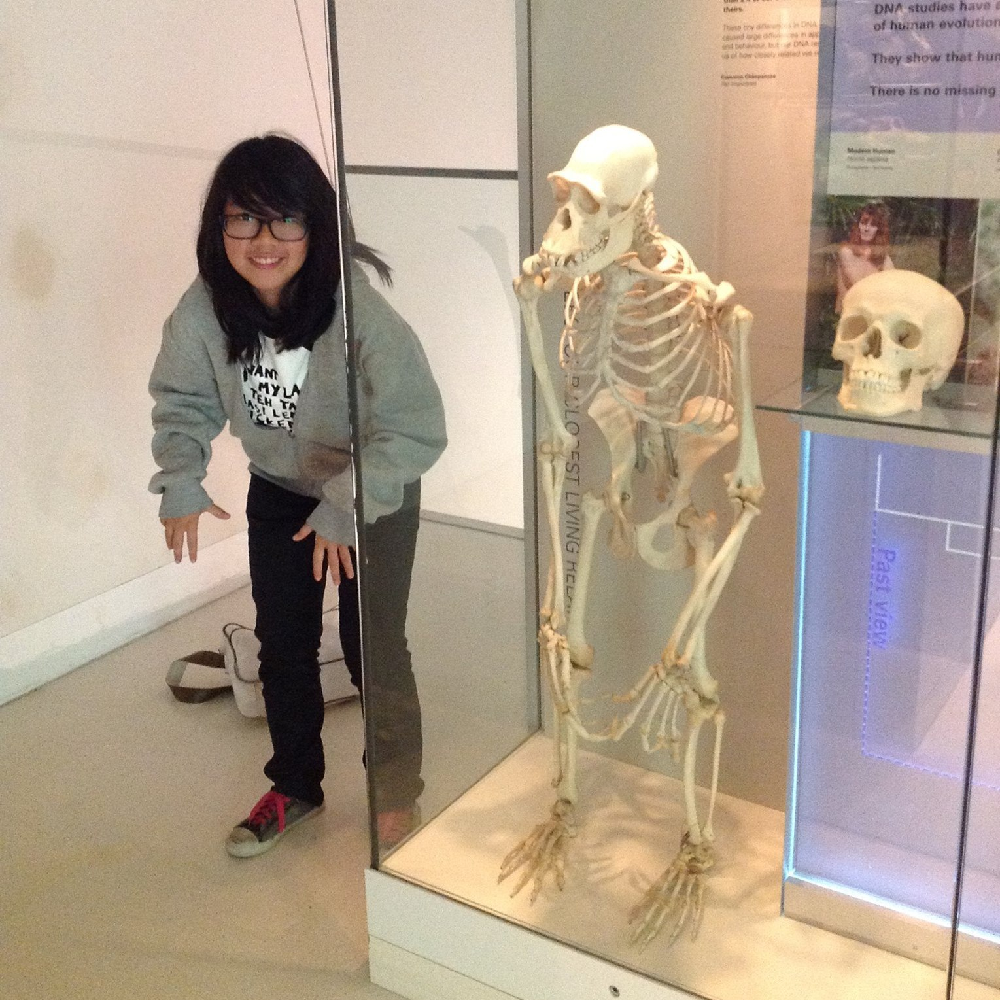

# About Us

We are a team based in the [School of Computing, National University of Singapore](http://www.comp.nus.edu.sg).

## Project Team

### [Chua Ka Yi Ong](https://github.com/kychua)

Role: Project Advisor

### [Paul Tan](https://github.com/pyokagan)

Role: Team lead  
Responsibilities: Integration

### [Sun Mingyang](https://github.com/nightism)

Role: Developer  
Responsibilities: Code Quality

### [Sneha Santha Prabakar](https://github.com/snehasp13)

Role: Developer  
Responsibilities: Testing

### [Sherry Wong Wen Qi](https://github.com/potatowagon)

Role: Developer  
Responsibilities: Documentation

# Original Authors

Task Tracker is based on [code](https://github.com/se-edu/addressbook-level4) by the following authors:

* [Damith C. Rajapakse](http://www.comp.nus.edu.sg/~damithch)
* [Joshua Lee](http://github.com/lejolly)
* [Leow Yijin](http://github.com/yijinl)
* [Martin Choo](http://github.com/m133225)
* [Thien Nguyen](https://github.com/ndt93)
* [You Liang](http://github.com/yl-coder)
* [Akshay Narayan](https://github.com/se-edu/addressbook-level4/pulls?q=is%3Apr+author%3Aokkhoy)
* [Sam Yong](https://github.com/se-edu/addressbook-level4/pulls?q=is%3Apr+author%3Amauris)
