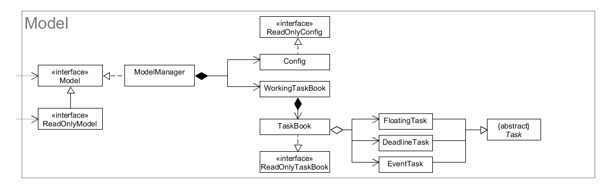
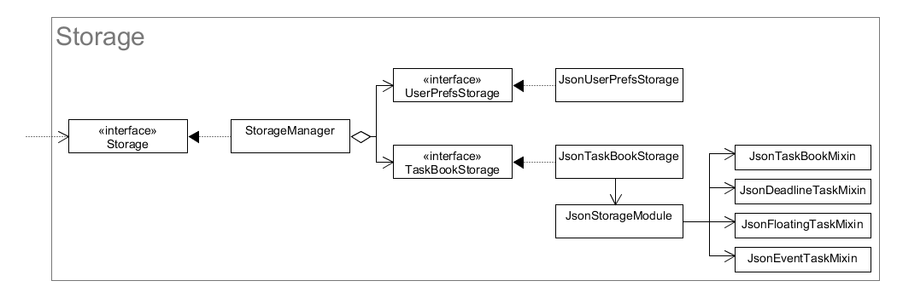
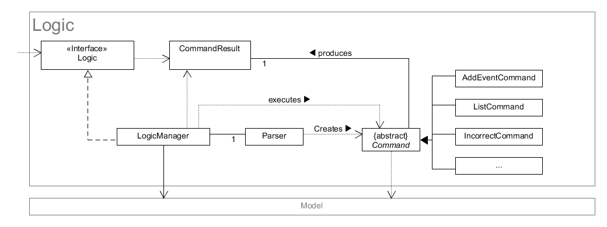
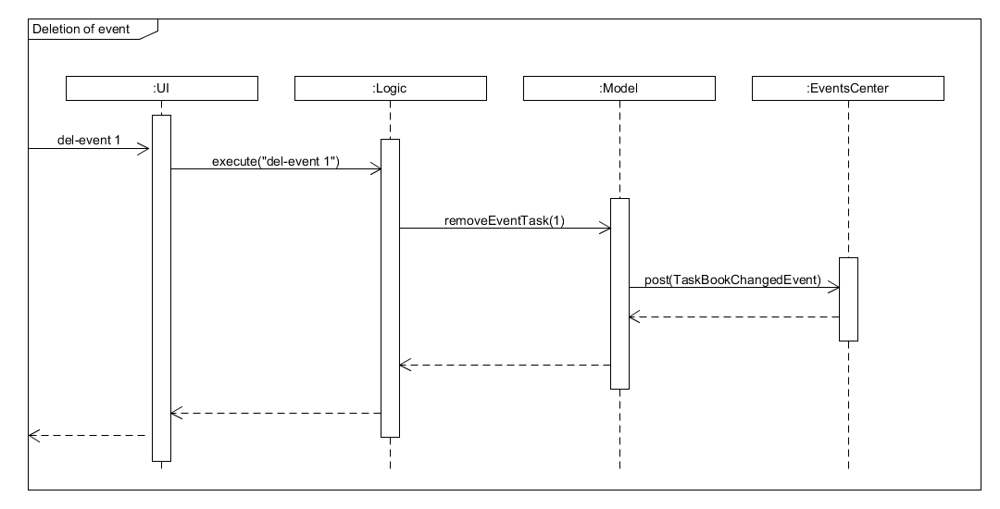
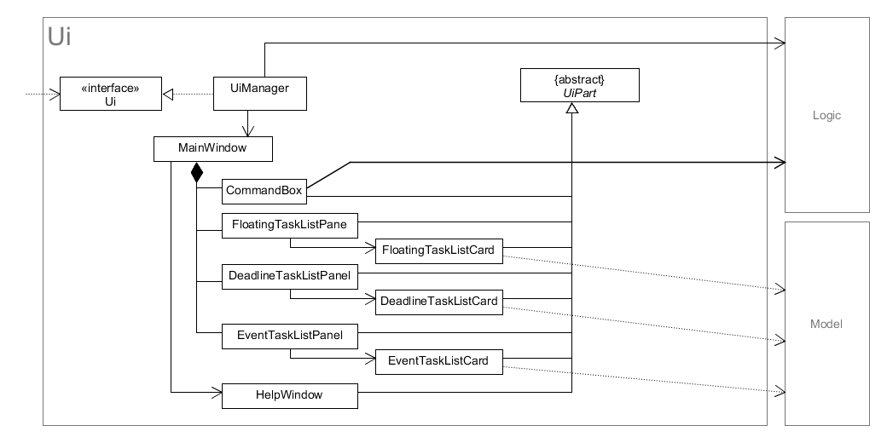

# Developer Guide

* [Setting Up](#setting-up)
* [Design](#design)
* [Implementation](#implementation)
* [Testing](#testing)
* [Appendix A: User Stories](#appendix-a-user-stories)
* [Appendix B: Use Cases](#appendix-b-use-cases)
* [Appendix C: Non Functional Requirements](#appendix-c-non-functional-requirements)
* [Appendix D: Glossary](#appendix-d-glossary)
* [Appendix E: Product Survey](#appendix-e-product-survey)

## Setting up

### Prerequisites

1. **JDK `1.8.0_60`**  or later 

    > Having any Java 8 version is not enough.
      This app will not work with earlier versions of Java 8.

2. **Eclipse** IDE

3. **e(fx)clipse** plugin for Eclipse (Do the steps 2 onwards given in [this
   page][efxclipse-install])

4. **Buildship Gradle Integration** plugin from the Eclipse Marketplace

[efxclipse-install]: http://www.eclipse.org/efxclipse/install.html#for-the-ambitious

### Importing the project into Eclipse

1. Fork this repo, and clone the fork to your computer

2. Open Eclipse (Note: Ensure you have installed the **e(fx)clipse** and
   **buildship** plugins as given in the prerequisites above)

3. Click `File` > `Import`

4. Click `Gradle` > `Gradle Project` > `Next` > `Next`

5. Click `Browse`, then locate the project's directory

6. Click `Finish`

* If you are asked whether to 'keep' or 'overwrite' config files, choose to
  'keep'.

* Depending on your connection speed and server load, it can even take up to 30
  minutes for the set up to finish (This is because Gradle downloads library
  files from servers during the project set up process)

* If Eclipse auto-changed any settings files during the import process, you can
  discard those changes.

### Troubleshooting project setup

**Problem: Eclipse reports compile errors after new commits are pulled from Git**

* Reason: Eclipse fails to recognise new files that appeared due to the Git
  pull.

* Solution: Refresh the project in Eclipse:

  Right click on the project (in Eclipse package explorer), choose `Gradle` ->
  `Refresh Gradle Project`.

**Problem: Eclipse reports some required libraries missing**

* Reason: Required libraries may not have been downloaded during the project
  import.

* Solution: [Run tests using Gradle](#testing-with-gradle) once to download all
  required libraries.

## Design

### Architecture

The **_Architecture Diagram_** given above explains the high-level design of
the App.

Given below is a quick overview of each component.

`Main` has only one class called [`MainApp`][mainapp-src]. It is responsible
for:

* At app launch: Initializes the components in the correct sequence, and
  connect them up with each other.

* At shut down: Shuts down the components and invokes their cleanup method
  where necessary.

[mainapp-src]: ../src/main/java/seedu/address/MainApp.java

**`Commons`** represents a collection of classes used by multiple other
components. Of these classes, two of them play important roles in the
application architecture:

* `EventsCentre`: This singleton class is used by components to communicate
  with other components using events.

* `LogsCenter`: This singleton class is used by classes to write log messages
  to the application log file.

The rest of the App consists of four components:

* [**`Model`**](#model-component): Holds the data of the application in-memory.

* [**`Storage`**](#storage-component): Reads data from, and writes data to,
  the hard disk.

* [**`Logic`**](#logic-component): Parses and executes commands.

* [**`Ui`**](#ui-component): The user interface of the application.

Each of the four components:

* Defines its _API_ in an `interface` with the same name as the Component.

* Exposes its functionality using a `{Component Name}Manager` class.

For example, the `Logic` component defines it's API in the `Logic.java`
interface and exposes its functionality using the `LogicManager.java` class.

The sections below give more details of each component.

### Model component

The `Model` component:

* holds the task book data in memory. In particular, it stores the list of
  floating, deadline and event tasks.

* exposes three lists for the stored floating, deadline and event tasks
  respectively.  These lists can be "observed". For example, the Ui component
  registers event listeners on these lists so that the Ui automatically updates
  when the data in these lists change.

### Storage component

The `Storage` component:

* can save `UserPref` objects in json format to the hard disk and read it back.

* can save `TaskBook` objects in json format to the hard disk and read it back.

### Logic component

The `Logic` component:

* parses and executes user commands.

* filters the lists of floating, deadline and event tasks in the task book.

It accomplishes its parsing and execution of user commands in a few steps:

1. `Logic` uses its own internal `Parser` to parse the user command.

2. This results in a `Command` object which is executed by the `LogicManager`.

3. The command execution can affect the `Model` (e.g. adding a task) and/or raise events.

4. The result of the command execution is encapsulated as a `CommandResult`
   object which is passed back to the `Ui`.

Given below is the Sequence Diagram for interactions within the `Logic`
component for the `execute("delete 1")` API call.

### Ui component

The `Ui` component,

* Executes user commands using the `Logic` component.

* Binds itself to some data in the `Model` so that the UI can auto-update when
  data in the `Model` change.

* Responds to events raised from various parts of the App and updates the UI
  accordingly.

The Ui consists of a `MainWindow` that is made up of parts e.g.`CommandBox`,
`ResultDisplay`, `EventTaskListPane`, `StatusBarFooter` etc. All these,
including the `MainWindow`, inherit from the abstract `UiPart` class.

The `Ui` component uses JavaFx UI framework. The layout of these UI parts are
defined in matching `.fxml` files that are in the `src/main/resources/view`
folder. For example, the layout of `MainWindow` is specified in
`src/main/resources/view/MainWindow.fxml`.

## Implementation

### Logging

We are using `java.util.logging` package for logging. The `LogsCenter` class is
used to manage the logging levels and logging destinations.

* The logging level can be controlled using the `logLevel` setting in the
  configuration file (See [Configuration](#configuration))

* The `Logger` for a class can be obtained using `LogsCenter.getLogger(Class)`
  which will log messages according to the specified logging level.

* Currently log messages are output through: `Console` and to a `.log` file.

**Logging Levels**

* `SEVERE`: Critical problem detected which may possibly cause the termination
  of the application

* `WARNING`: Can continue, but with caution

* `INFO`: Information showing the noteworthy actions by the App.

* `FINE`: Details that are not usually noteworthy but may be useful in
  debugging e.g. print the actual list instead of just its size

## Configuration

By default, the application stores its configuration in the `config.json` file.
This file can be modified to change the configuration of the application.

* `appTitle`: The title of the application. This title will be displayed in the
  user interface. (Default: `Task Tracker`)

* `taskBookName`: Name of the user's task book. This name will be displayed in
  the user interface. (Default: `MyTaskBook`)

* `logLevel`: Sets the minimum required level for log messages to be
  output. See [Logging Levels](#logging-levels) for the list of available
  levels. (Default: `INFO`)

* `userPrefsFilePath`: The path to the user's preference file. (Default:
  `preferences.json`)

* `taskBookFilePath`: The path to the user's task book file. (Default:
  `data/taskbook.json`)

## Testing

Tests can be found in the `./src/test/java` folder.

We have two types of tests:

1. **GUI Tests** - These are _System Tests_ that test the entire App by
   simulating user actions on the GUI.  These are in the `guitests` package.

2. **Non-GUI Tests** - These are tests not involving the GUI. They include:

   1. _Unit tests_ targeting the lowest level methods/classes.

      e.g. `seedu.address.commons.UrlUtilTest`

   2. _Integration tests_ that are checking the integration of multiple code
      units (those code units are assumed to be working).

      e.g. `seedu.address.storage.StorageManagerTest`

   3. Hybrids of unit and integration tests. These test are checking multiple
      code units as well as how the are connected together.

      e.g. `seedu.address.logic.LogicManagerTest`

### Testing with Eclipse

* To run all tests, right-click on the `src/test/java` folder and choose `Run
  as` > `JUnit Test`

* To run a subset of tests, you can right-click on a test package, test class,
  or a test and choose to run as a JUnit test.

### Testing with Gradle

* To run all tests, execute the following in the project work
  directory:

      ./gradle test

* To only run non-GUI tests, execute the following in the project work
  directory:

      ./gradle -PguiTests=false test

### Troubleshooting tests

**Problem: Tests fail because a NullPointException was thrown when
AssertionError is expected**

* Reason: Assertions are not enabled for JUnit tests.
  This can happen if you are not using a recent Eclipse version (i.e. _Neon_ or later)

* Solution: Enable assertions in JUnit tests as described
  [here](http://stackoverflow.com/questions/2522897/eclipse-junit-ea-vm-option).
  Delete run configurations created when you ran tests earlier.

## Appendix A: User Stories

Priorities:

* `* * *` -- High (must have)
* `* *` -- Medium (nice to have)
* `*` -- Low (unlikely to have)

User categories:

* User -- Any user
* New user -- User that has used Task Tracker for less than 100 hours
* Busy user -- User that has a high density of deadlines and/or events over the
  next 1 month
* Power user -- A user that likes to do things with as few interactions
  (keystrokes, mouseclicks, confirmations) as possible.
* Group user -- User that has other people working on the same task

Priority | As a ... | I want to ... | So that I can...
-------- | :------- | :------------ | :---------------
`* * *`  | New user | See the manual | refer to manual when I forget how to use the App
`* * *`  | User | Add an event to the task manager | keep track of it and be notified when it is approaching.
`* * *`  | User | Add a deadline to the task manager | keep track of it and be notified when it is approaching.
`* * *`  | User | Add a floating task to the task manager | Keep track of it and remember to do it when I'm free
`* * *`  | User | View my floating tasks | keep track of them.
`* * *`  | User | Search specific tasks by keywords |
`*`  | Power user | Have shortcut keys to launch the app | Launch the app quickly
`* `  | Power user | Have shortcut keys to minimise the app | Hide the app with only the keyboard
`* * *`    | User | Mark a deadline as finished before the due time | Remove it from the notification list and archive it.
`* * *`    | User | Mark a floating task as finished | Remove it from my floating task list.
`* *`    | User who has events taking place at multiple locations | Add the location of an event | Be reminded of where to go.
`* *`    | User | Have the app notify me of the error in my command, and suggest the right command when I make a typo/forget the format of the command | Enter in the correct command immediately without having to open up the manual.
`* *`    | Busy user | View what events or deadlines are scheduled over a range of time | Ensure that the event does not clash with other events or deadlines.
`* * *`    | User | Revise the due datetime for a certain deadline. | Keep track of it and avoid creating a new deadline when the time has been revised.
`* * *`    | User | Revise the timeslot for a certain event | Keep track of it and avoid creating a new event when the time has been revised.
`* *`    | Busy user | Generate a list of all empty time slots in a given period | Choose a free time slot to create new events or tasks.
`* * *`    | User | Undo an action | Restore tasks deleted by accident.
`* * *` | User | Redo an action | Reverse an action done by undo. 
`*`      | User who is unable to remember details of each task | Add a short description under the name of each task in my schedule | Know how to do the task and where, even if I forget these details by any chance.
`*`      | Busy user | Tags such as coloured dots, or icons, for each task which indicates the priority of the task (on a scale of 1-3) | Able to decide which task needs to be completed urgently
`*`      | Group user | Option to categorize my task as a "Group activity" and automatically send notifications (through mail or other social networking platforms) to all other users who are in my team, whenever I make any changes to our work schedule for the group activity; and send them reminders about upcoming deadlines for the tasks. Every time I add a new task, I should have also an option to either include it to an existing group activity or add it to a new group activity (different commands for each of these operations). | Improve my work efficiency, and make sure everyone in my team are aware of the work schedule of our project.
`* `     | User who needs to be reminded of the task before the deadline date. | Set reminders at customized times before the deadline. | Have enough time to complete the task before deadline, even if I forgot to do it.

## Appendix B: Use Cases

**Software System**: TaskTracker

**Actor**: User

### Use case: Add an event

**MSS**

1. User requests to add an event with the specified name, start date/time and
   end date/time.

2. TaskTracker adds the event to the database, and notifies the user that the
   event was successfully added.

   Use case ends.

**Extensions**

1a. The start datetime occurs after the end datetime.

> 1a1. TaskTracker notifies the user that the start datetime and end datetime
>      are invalid.

> Use case ends.

1b. The range of time specified by the start datetime and end datetime occurs
    in the past.

> 1b1. TaskTracker warns the user that the event is in the past.

> Use case resumes from step 2.

1c. The name of the event contains invalid characters.

> 1c1. TaskTracker notifies the user that the event name contains which invalid
>      character(s).

> Use case ends.

1d. The name of the event contains leading/trailing whitespace.

> 1d1. TaskTracker silently strips the leading/trailing whitespace from the
>      name.

> Use case resumes from step 2.

### Use case: Add a deadline

**MSS**

1. User requests to add a deadline with the specified name and end date/time.

2. TaskTracker adds the deadline to the database, and notifies the user that
   the deadline was successfully added.

   Use case ends.

**Extensions**

1a. The end datetime occurs in the past.

> 1a1. TaskTracker warns the user that the end datetime is in the past.

> Use case resumes from step 2.

1b. The name of the deadline contains invalid characters.

> 1b1. TaskTracker notifies the user that the deadline name contains which
>      invalid character(s).

> Use case ends.

1c. The name of the deadline contains leading/trailing whitespace.

> 1c1. TaskTracker silently strips the whitespace from the name.

> Use case resumes from step 2.

### Use case: Add a floating task

**MSS**

1. Use requests to add a floating task with the specified name.

2. TaskTracker adds the floating task to the database at the lowest priority,
   and notifies the user that the floating task was successfully added.

   Use case ends.

**Extensions**

1a. The name of the floating task contains invalid character(s).

> 1a1. TaskTracker notifies the user that the floating task name contains which
>      invalid character(s).

> Use case ends.

1b. The name of the floating task contains leading/trailing whitespace.

> 1b1. TaskTracker silently strips the leading/trailing whitespace from the
>      name.

> Use case resumes from step 2.

### Use case: View all floating tasks

**MSS**

1. User requests to view all floating tasks.

2. TaskTracker displays all floating tasks in the database as a list, ordered
   from highest to lowest priority.  
   Use case ends.

**Extensions**

1a. There are no floating tasks in the database.

> 1a1. TaskTracker notifies the user that there are no floating tasks in the
>      database.

> Use case ends.

### Use case: Revise the due time of a deadline task

**MSS**

1. User requests to update the due datetime of a certain deadline with new
   date/time information.

2. TaskTracker revises the deadline to the new time, and notifies the user that
   the due date/time was successfully revised.

   Use case ends.

**Extensions**

1a. The requested deadline task does not exist.

> 1a1. TaskTracker informs the user that the requested deadline does not exist.

> Use case ends.

1b. The new time is the same as the previous due datetime.

> 1b1. TaskTracker informs the user that the datetime remains unchanged.

> Use case ends.

1c. The new date/time occurs in the past.

> 1c1. TaskTracker warns the user that the end datetime is in the past.

> Use case resumes from step 2.

### Use case: Revise the time of an event

**MSS**

1. User requests to revise the the time of a certain deadline with new
   date/time information.

2. TaskTracker revises the event to a new time slot, and notifies the user that
   the time was successfully revised.

   Use case ends.

**Extensions**

1d. The requested event does not exist.

> 1a1. TaskTracker informs the user that the requested event does not exist.

> Use case ends.

1b. The range of time specified by the start datetime and end datetime
    intersects with the start-end datetime range of other event(s).

> 1b1. TaskTracker warns the user that the event clashes with which event(s).

> Use case resumes from step 2.

1c. The start datetime occurs after the end datetime.

> 1c1. TaskTracker notifies the user that the start datetime and end datetime
> are invalid.

> Use case ends.

1d. The range of time specified by the start datetime and end datetime occurs
    in the past.

> 1e1. TaskTracker warns the user that the event is in the past.

> Use case resumes from step 2.

1e. The new datetime is the same as the existing datetime.

> 1e1. TaskTracker informs the user that the datetime remains unchanged.

> Use case ends.

### Use case: mark a floating task/deadline as finished

**MSS**

1. User requests to mark a certain floating task/deadline as finished.

2. TaskTracker marks the task as finished and informs the user.
   Use case ends.

**Extensions**

1a. The floating task does not exist.

> 1a1. TaskTracker informs the user that the floating task does not exist.

> Use case ends.

### Use case: Generate a list of empty time slots

**MSS**

1. User request to generate a list of free time slots in a certain period with
   certain time duration.

2. TaskTracker lists all possible time slots in that period  
   Use case ends.

**Extensions**

1a. The time period requested is invalid (wrong format or time in the past)

> 1a1. TaskTracker shows an error message.

> Use case ends.

1b. The input duration is in wrong format

> 1b1. TaskTracker shows an error message to inform the error.

> Use case ends.

2a. There is no feasible time slot

> 2a1. TaskTracker shows an empty list and throw a message saying there is no
> avaliable time slots for the user in the given time period.

> Use case ends.

### Use case: Add priority tags

**MSS**

1. The user requests to add a priority tag for a specified event.

2. TaskTracker prompts the user to select the priority level of the event -
   "Very Important"/ "Important"/ "Not important".

3. The user selects the appropriate priority level for the event from these
   options.

4. TaskManager updates the priority of the event with the specified priority.

5. The user is notified that the update was successful.

   Use case ends.

**Extensions**

1a. The user places a request to add a priority tag, but does not add it.

> 1a1. User presses "Esc". TaskTracker goes back to the normal view of the
> schedule. Now even if the user clicks on any event, priority tag options will
> not be displayed as the TaskTracker switched from Priority Tag view to Normal
> view.

> Use case ends.

### Use case: Add new event under a specific "group activity"

**MSS**

1. When the user is adding a new event, he selects the option "Group Activity"
   which is present in the same window.

2. The existing group activities are displayed and the user chooses the one
   which is related to the new event that he is adding.

3. If he wants to create a new group activity, then the user places a request
   to add new group activity in the “Group Activity” window.

5. The user then enters the details of the group activity (such as name of the
   group activity and email addresses of the people in the group).

6. TaskTracker automatically adds the event to this new activity.

7. TaskTracker notifies the user that the event has been added to the schedule.

   User case ends.

**Extensions**

1a. The user enters an invalid email address of a group member, while creating
a new group activity.

> 1a1. TaskTracker displays the error message - "Invalid email".

> Use case ends.

1b. The user enters a group activity name that already exists, while adding a
    new group activity.

> 1b1. TaskTracker displays an error message "Name already exists".

> Use case ends.

### Use case: Add event description

**MSS**

1. The user requests to add a new event.

2. The user writes a small description about the event in the "Description"
   field, present in the "Add new event" window.

3. The event is added and the user is notified about the new event added.

   User case ends.

### Use case: Set reminders

**MSS**

1. When adding a new event, the user adds the time at which he wants to set a
   reminder, before the event occurs. The time is entered in day/hours/minutes
   format.

2. The new event is added to the schedule and the user is notified about the
   addition of the new event.

   User case ends.

**Extensions**

1a. The user enters the time in a wrong format.

> 1a1. TaskTracker shows an error message "Invalid time format"

> User case ends.

### See the manual

**Use case: see the manual**

**MSS**

1. User requests to see the manual.

2. TaskTracker shows manual.

   Use case ends.

### Search the manual

**Use case: search the manual**

**MSS**

1. User request to search the manual for a specific command.

2. TaskTracker shows the specific manual command.

   Use case ends

**Extensions**

1a. The command to be searched does not exist

> 1a1. TaskTracker informs the user that the command does not exist.

> Use case ends

### Undo an action

**User case: Undo an action, such as restoring a deleted a task**

**MSS**

1. The user wants to undo a completed action

2. The previous action is undone. Task manager is restored to state before the
   completed action.

   User case ends.

**Extensions**

1a. There is no action to undo

> 1a1. TaskTracker shows an error message "no action to undo"

> User Case ends.

## Appendix C: Non Functional Requirements

1. Should work on any mainstream OS as long as it has Java `1.8.0_60` or higher
   installed.

2. Should come with automated unit tests and open source code.

3. Have the app notify me of the error in my command, and suggest the right
   command when I make a typo/forget the format of the command.

4. Storage should not use relational databases, but an editable text file.

5. For a full list of constrains, see the handbook at http://www.comp.nus.edu.sg/~cs2103/AY1617S1/contents/handbook.html#handbook-project-constraints  

## Appendix D: Glossary

<dl>
  <dt>Task book</dt>
  <dd>The database where events, deadlines and floating tasks are stored.</dd>

  <dt>Datetime</dt>
  <dd>Date and Time</dd>

  <dt>Task</dt>
  <dd>A unit of information in the task book database. Each task has a name.</dd>

  <dt>Event</dt>
  <dd>Task that has a start datetime and end datetime</dd>

  <dt>Deadline</dt>
  <dd>Task that has an end datetime only.</dd>

  <dt>Floating task</dt>
  <dd>A task that has neither a start datetime not end datetime./dd>

  <dt>Time slot</dt>
  <dd>A time slot is referring to a period of time</dd>
</dl>

## Appendix E: Product Survey

### Todo.txt

Full product survey [here](productsurveys/todo.txt.md)

Jim's Requirement | Todo.txt Support
:---------------- | ----------------
Summoned quickly from anywhere | No
Keyboard-oriented. Jim can type commands in "one shot" | Yes
Works offline | Yes
Simple search | Yes
CRUD support for floating tasks | Full
CRUD support for deadlines | Partial
CRUD support for events | Partial
Keep track of which items are done/not done | Yes
Look for a suitable slot to schedule an item | No
Ability to "block" multiple slots | No
Flexibility in command line format | Tiny
Undo operations | No

Todo.sh, as a command-line application, is fully keyboard oriented and thus
suitable for power users who prefer entering commands in one shot. As it only
operates on local text files, it works fully offline.

Furthermore, its data model and user interface is specially geared towards the
creation, reading, updating and deleting (CRUD) of floating tasks, which it
does quite well. One exception is the interface to edit the name of a task,
which is very clunky as it requires the user to repeat existing
information.

While the simplicity and flexibility of its data model means that CRUD
operations on deadlines and events are technically feasible, the lack of
explicit support from the application and data model means that the user
interface is poor and error checking is lacking. Users who store their
deadlines and events in todo.txt, without understanding how it works under the
hood, would thus be in for some nasty surprises.

Furthermore, the lack of explicit support for deadlines and events means that
the application has no support at all for looking for a slot to schedule an
item and the ability to “block” multiple time slots, as it has no concept of
time at all.

Finally, it has no support for undoing operations. While this is alleviated
somewhat as it asks for confirmation before deleting tasks, all other
operations are done without user confirmation.

### Todoist

Full product survey [here](productsurveys/Todoist.md)

Jim’s Requirement | Todoist support
:---------------- | ------------------
Summoned quickly from anywhere | No
Keyboard-oriented. Jim can type commands in “one shot”. | No
Keyboard-oriented. Jim can use keyboard shortcut to increase efficiency. | Yes
Works offline | Yes
Simple Search | Yes
CRUD support for floating tasks | Full
CRUD support for deadlines | Full
CRUD support for events | None
Keep track of which items are done/not done | Yes
Look for a suitable time schedule a task. | Tiny
Ability to “block” multiple slots. | No
Flexibility in command line format. | No
Undo operations | Partial

Todoist is a half keyboard oriented cross-platform applications, with plenty of
useful keyboard short-cut on both PC and Web clients. It can work both online
or offline on mobile phone or personal computer.

It fully supports creation, reading, updating and deleting (CRUD) function of
floating tasks and deadline-like task. The user interface is well designed and
user can perform their actions quite easily through it. Besides, user can also
conduct simple searching action among all task he or she has created. However,
Todoist also does not support the functionality to add event-like task at all.

Also for premium account, Todoist also gives the support of tracking the task
that has already been done or finished, which gives convenience for user to
record their working history.

Besides, Todoist can automatically suggest how many tasks have already existed
on a certain day when creating the tasks. But since Todoist does not support
event-like task, it also has no support at all for generating suggestion of
suitable time-slots or placing multiple time slots/blocks when creating the
tasks.

Moreover, Todoist does support undo-actions, but only for the last one actions
the user performs.

Furthermore, there are several features that we could learn from Todoist. The
first one is the "Quick-Add" function which enables the user to add either
floating task or deadline task in a single window. The second one is the "Undo"
command, which enables the user to undo the last command immediately when them
perform wrongly.

### Wunderlist

Full product survey [here](productsurveys/Wunderlist.md)

Wunderlist in brief: Written in Javascript and PHP, Wunderlist is a task
manager application with a simple, intuitive,and beautiful User Interface that
is installed locally on the hard disk. It has server functions to share todo
lists and is able to sync information using a Wunderlist account. Thus CRUD of
local tasks work offline, but with online, additional syncing, sharing and
collaborating features are accessible.

So, how well does Wunderlist satisfy Jim's requirements?

| Jim's Requirement | Wunderlist support |
| --- | --- |
| Summoned quickly from anywhere | No |
| Keyboard-oriented. Jim can type commands in "one shot". | Partially |
| Works offline | Yes |
| Simple Search | Yes |
| CRUD support for floating tasks | Full |
| CRUD support for deadlines | Full |
| CRUD support for events | None |
| Keep track of which items are done/not done | Yes |
| Look for a suitable slot to schedule an item. | No |
| Ability to "block" multiple slots. | No |
| Flexibility in command line format. | No |
| Undo operations | Tiny |

### Google Calendar

Full product survey [here](https://docs.google.com/document/d/1ELun1gQUiVAxC6it-16jikFRwAePTXS5Xri7GdhUnL8/edit?usp=sharing)

Jim's Requirement | Google Calendar
:---------------- | ----------------
Summoned quickly from anywhere | Yes
Keyboard-oriented. Jim can type commands in "one shot" | Yes
Works offline | Partially
Simple search | Yes
CRUD support for floating tasks | No
CRUD support for deadlines | Yes
CRUD support for events | Partially
Keep track of which items are done/not done | No
Look for a suitable slot to schedule an item | Yes
Ability to "block" multiple slots | Fully
Flexibility in command line format | No
Undo operations | Yes

Google Calendar is essentially a time-management mobile and web application
developed by Google. It is a good platform for office workers, such as Jimmy to
organize their schedule. It has most of the features that an office worker like
Jim would require; for example, Add/Edit/Delete tasks, automatically find free
slots in the schedule to add new tasks, “quick add”, ability to block multiple
tasks, etc. It can also support features such as import, export and sync with
desktop programs such as Outlook  and also, with mobile devices. However, it
also has a few drawbacks for workers like Jim - New tasks or modification of
existing tasks cannot be performed when the user is offline, it does not
display floating tasks, and also does not display the status of a task as
"done" or "not done".

We have taken some reference features from Google Calendar to implement in our
own time management software. Some of these include having an feature to find
empty time slots in the user’s schedule. While adding an event in Google
Calendar, the users have an option called "Find Time" in which all the free
slots in their schedule are displayed and they can choose any one for adding
their task.
