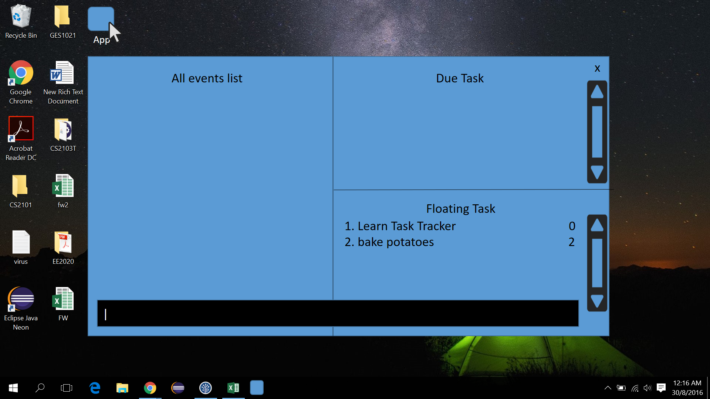
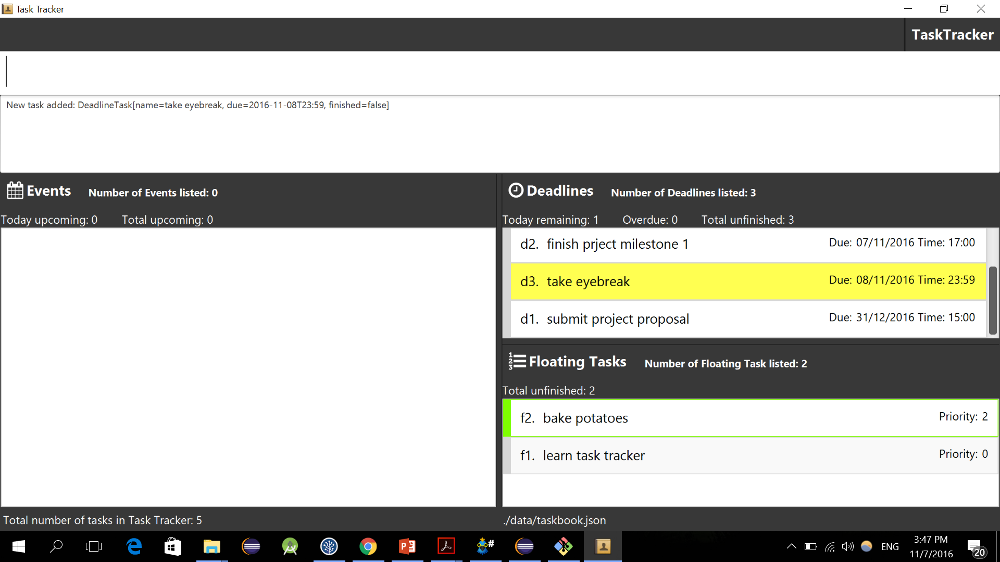
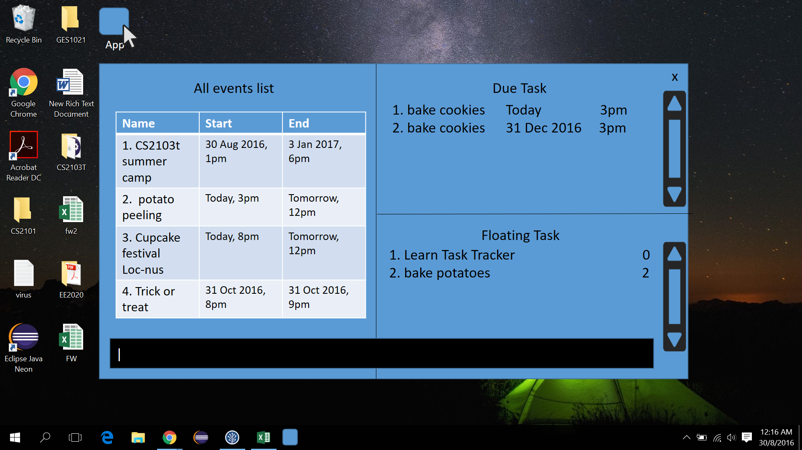
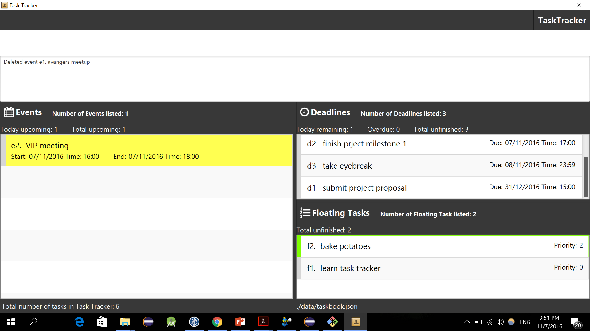
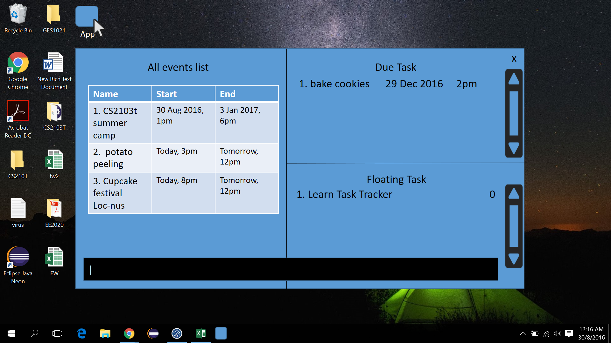
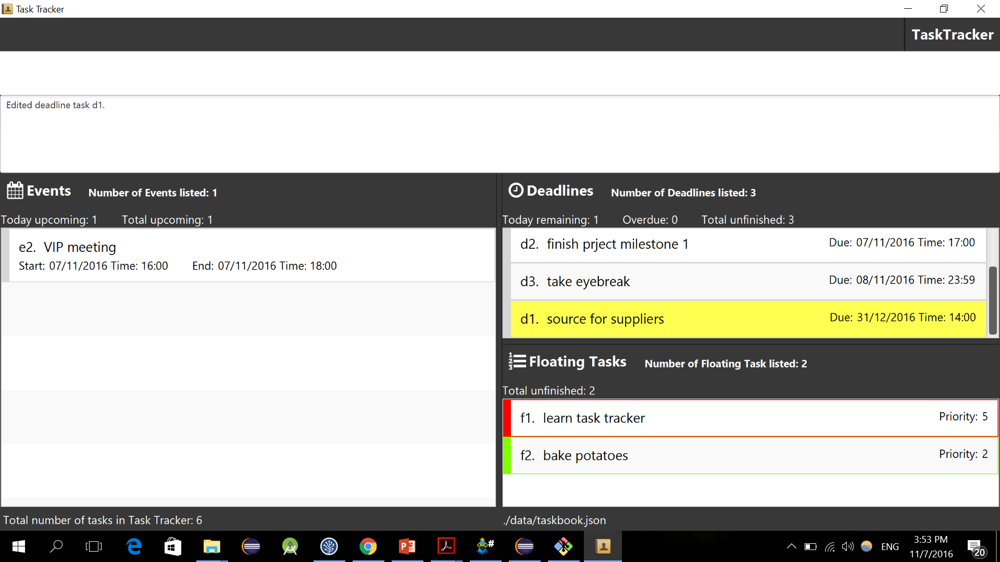
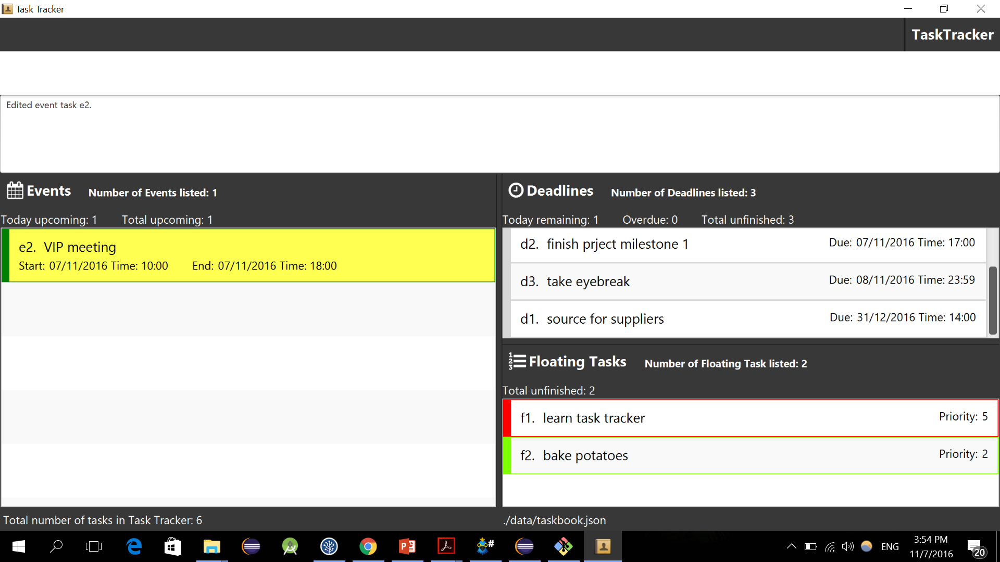
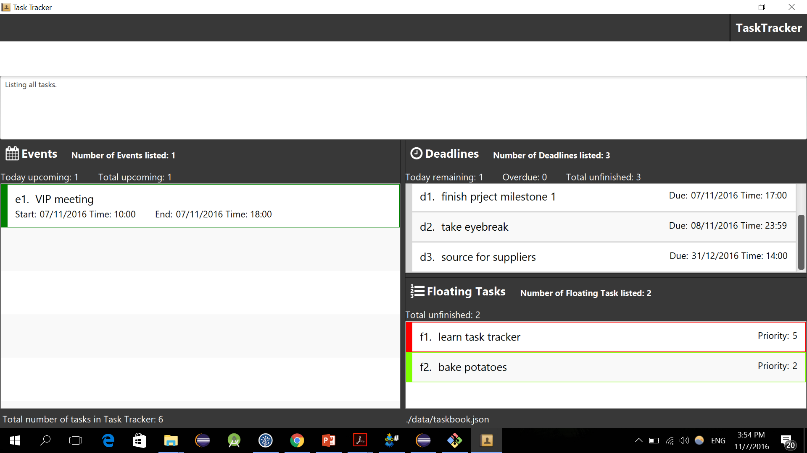

# User Guide

* [About] (#about)
* [Quick Start](#quick-start)
	* [Quick Start Summary](#qss)
* [Features](#features)
	* [Data Models](#dm)
    * [Command Format](#cf)
    * [Parameter Keywords](#pk)
    * [Date Format](#DateFormat)
    * [Time Format](#TimeFormat)
    * [Viewing Help](#help)
    * [Add Floating Task](#addft)
    * [Add Deadline Task](#adddt)
    * [Add Event](#adde)
    * [Delete](#del)
    * [Edit Floating Task](#editft)
    * [Edit Deadline Task](#editdt)
    * [Edit Event](#adde)
    * [Mark Finish](#fin)
    * [Show Empty Timeslots](#slot)
    * [Search](#search)
    * [Undo](#undo)
    * [Redo](#redo)
    * [Clear](#clear)
    * [Exit](#exit)
* [Command Summary](#command-summary)

## About

Unable to keep track of all your deadlines and other commitments?  Finding it
difficult to remember tasks which do not have a specific date and time, but
nevertheless needs to be done? Find yourself wasting time searching for
time-management software online, and selecting multiple options each time you
want to modify a task?

Fret not, TaskTracker is here to your rescue!

To be simply defined, TaskTracker is a digital assistant that keeps your
schedule neat and organized. It displays all your events lined up for the day,
upcoming deadlines and also tasks that do not have a specific time/ date, on
the same window.

You can perform various operations such as add/ delete/ edit/ prioritize, on
your events by simply typing a one-line command. You don’t need to waste any
more time navigating through multiple options or filling multiple fields every
time you want to modify your schedule.

TaskTracker makes time-management smart and simple for you!

## Quick Start

1. Ensure you have Java version `1.8.0_60` or later installed in your computer.

  > Having any Java 8 version is not enough.
  > This app will not work with earlier versions of Java 8.

2. Download the latest `TaskTracker.jar` from the 'releases' tab.

3. Copy the file to the folder you want to use as the home folder for your task
   database.

4. Double-click the file to start the app. The GUI should appear in a few
   seconds.

5. Set up: enter your name and verify the current date and time.

6. You're good to go! Try adding your first Task. Press Enter to enter a
   command. For floating task, try `add "Learn Task Tracker"`.

   

   Let's do another one, `add "bake potatoes" 2`

   

   Notice how bake potatoes is below Learn Task Tracker. That's because bake
   potatoes is of number 2 priority, while Learn Task Tracker with an undefined
   priority takes the default highest priority number of 0.

7. Let's add deadline tasks with due date and time.

	* `add "bake cookies" 31/12 3pm`

      bake cookies by 31 December of this year, 3pm. Undeclared year in date
      field will be taken as the current year.

	* `add "bake cookies" tdy 3pm`

      Bake cookies by today, 3pm.

   

8. Next up, events. An event is a task with a start date, start time, end date
   and end time. Example commands are:

	* `add "CS2103t summer camp" 30/8 1pm 3/1/2017 6pm`

      Event CS2103t summer camp starts on 30 Aug 2016, 1pm, and ends on 3
      January 2017,6pm.

	* `add "potato peeling" tdy 3pm to 7pm`

      Event potato peeling starts today 3pm and ends today 7pm.

	* `add "cupcake festival" tdy 8pm tmr 12pm loc-NUS`

      Event cupcake festival starts today 8pm and ends tomorrow 12 pm at NUS.

	* `add "Trick or treat" 31/10 8pm to 9pm`

      Event Trick or treat starts 31 October this year 8pm and ends on the same
      day, 9pm.

    

9. All task in the database will be assigned a unique index. The unique index
   can be seen to the left of the task name.

10. To delete a task, try:

        del-float 2

    Delete floating task bake potatoes.

        del-deadline 1

    Delete deadline task bake cookies.

        del-event 4

    Delete Event Trick or treat.

    

11. To edit a deadline, try:

	* `edit-deadline 1 dd-29dec dt-2pm`

      The following properties of task are modified: due date, due time.  (`dd`
      refers to due date, `dt` refers to due time)

	* `edit-deadline 1 dt-3pm`

      Only due time of bake cookies modified.

      

12. To edit an event, try:

	* `edit-event 2 loc-NUS`

      Location of potato peeling set to NUS.

	* `edit-event 3 st-3pm sd-12oct et-5pm ed-13oct loc-Yishun`

      All fields modified. (`st` : `starting time`, `sd` : `starting date`,
      `et` : `ending time`, `ed` : `ending date`)

      

    * `edit-event 2 st-3pm`

      Start time of potato peeling modified.

      

13. To edit a floating task, try:

	* `edit-float 1 p-1`

       Floating Task Learn Task Tracker is given a priority of 1.

       

14. You've finished a task. Congrations! Let's mark a task as finshed.

    * `fin-float 1`

    Floating task Learn Task Tracker is marked as finished.

15. To exit the program, try:

	* `exit`

      Close the Task-tracker.

16. Refer to the [Features](#features) section below for details of each
    command.

<a name="qss">**Quick Start Summary**</a>

| Command | Essential Parameters|
|---------|:----------|
|add| `"taskname"`   `"deadline task name"` `date` `time`   `"event name"` `start date` `start time` `end date` `end time`|
| edit | `-float` `index` `n-` `p-`   `-deadline` `index` `n-` `dd-` `dt-`   `-event` `index` `n-` `sd-` `st-` `ed-` `et` `loc-`  
| del | `-float` or `-deadline` or `-event` `index`|
| fin |`-float` or `-deadline` or `-event` `index`|
| exit | |

## Features

### <a name="dm">Data models</a>

The task stored in Task Tracker will be automatically grouped into three
different type of task: floating task, deadline task, and event, depending on
the type and number of fields entered when creating the task.

|A/An... | has...|
|----| :--------:|:------|
|Floating Task | only a task name|
|Deadline task |  end time and date |
|Event | start time and date,  end time and date|

All the time and date fields of the task have to be entered in order to create the task.

<a name="cf">**Command Format**</a>

* Words in `UPPER_CASE` are parameters to be defined by the user.

* Words in `lower_case` are the reserved keywords.

* Items in `[SQUARE_BRACKETS]` are optional parameters.

* Items in `<ANGLE_BRACKETS>` essential parameters. All essential parameters
  have to be included in the command.

* Items separated by `|` are in parallel relation, only one of them should be
  use in each command.

* Items with `...` after them can have multiple instances.

* The parameters have to follow the order in which they are presented, unless
  otherwise specified.

### <a name="pk">Parameter keywords</a>

|Keyword | Definition|
|----| :--------:|
|`tdy` | today|
|`tmr` | tommorow|
|`yst` | yesteday|
| `to` | to |

### <a name="DateFormat">Date format</a>

Valid input examples:

* dd/mm/yy

      31/12/2016

* dd/mm

      31/12

  If the year is not defined, the year is assumed to be the current year. The
  year this document was last updated was 2016, therefore all examples
  protraying the current year will read 2016.

* dd

      31

  If the month is not defined, the month is assumed to be the current month.

* Today

      tdy

  Means today, the current date as logged by the local machine.

* Tommorow

      tmr

  Means tommorow, the day after today as logged by the local machine.

* To

      to

  This keyword is only applicable for adding an event. `to` can only be
  entered into an `<END_DATE>` field. `to` would mean the `<END_DATE>` is the
  same as the `<START_DATE>` for an event. See [example](#to).

### <a name="TimeFormat">Time Format</a>

The 12 hour clock is used. hh:mm am/pm

Valid input examples:

    8:30am

8:30am in the morning

	11:45pm

11:45pm at night

	8:00pm

8:00pm at night

If the minute field is 00, it may be ommitted from the command.

### <a name="help">Viewing help : `help`</a>

    help

Help is also shown if you enter an incorrect command e.g. `abcd`

### <a name="addft">Adding a floating task : `add`</a>

Adds a floating task to TaskTracker.

    add <"FLOATING_TASK_NAME"> [PRIORITY]

* Task name should be in a pair of quotation marks. And quotations marks are
not allowed in task name.

* Task name could be a single word or a phrase, white space are allowed.

* The floating task will be shown according to their `PRIORITY`.

* Two floating tasks with the same `PRIORITY` will be shown according to
  the order of the time they are created.

* The `PRIORITY` attribute is an integer which ranges from `0` to `5`, with 0
  being the highest pririoty and 5 the lowest.

* The default priority of a floating task is 0.

#### Examples

* `add "EE2020 lab report" 5`

  To create a task called `EE2020 lab report` with `PRIORITY` of 5.

* `add Progress Reflection`

  To create a task called `Progress Reflection` with default `PRIORITY` of 0.

### <a name="adddt"> Adding a deadline task: `add`</a>

Adds a deadline with specific due date and time to TaskTracker.

    add <"DEADLINE_NAME"> <DATE> <TIME> [PRIORITY]

* Deadline name should be in a pair of quotation marks. And quotations marks
  are not allowed in deadline name.

* Keywords like `tdy`, `tmr`, `yst`, are allowed in the date field.

* Formats of `DATE` and `TIME` should follow those stated above in this user
  guide. See [Date Format](#DateFormat) and [Time Format](#TimeFormat)

#### Examples

* `add "CS2103 V1.1" 16/12 2pm`

  To create a deadline task named `CS2103 V1.1` with deadline of 16th December
  2016, 2pm.

* `add "spend pizza vouchers" 20/11/2018 2pm`

  To create a deadline task named `spend pizza vouchers` with deadline of 20
  November 2018, 6pm.

* `add "event proposal" tdy 6pm`

  To create a deadline named `event proposal` with due date today, 6 pm.

* `add "EE2024 homework 1" tmr 6am`

  To create a deadline named `EE2024 homework 1` tommorow, 6 am.

### <a name="adde"> Adding an event: `add`</a>

Adds an event with specific start date, start time and end date, end time to
TaskTracker.

    add <"EVENT_NAME"> <START_DATE> <START_TIME> <END_DATE> <END_TIME> [loc-LOCATION]

* Event name should be within a pair of quotation marks. Quotations marks are
  not allowed in event name.

* The four parameters `START_DATE`, `START_TIME`, `END_DATE`, `END_TIME` are
  all required for adding an event.

* Formats of `START_DATE`, `START_TIME`, `END_DATE`, `END_TIME` should follow
  those stated above in this user guide. See [Date Format](#DateFormat) and
  [Time Format](#TimeFormat)

* `[LOCATION]` is a String which could contain any characters.

#### Examples

* <a name="to">`add "CS2103 week8 lecture" 7oct 2pm to 4pm`</a>

  To create an event `CS2103 week8 lecture` with starting date 7 October 2016,
  starting time 2pm, ending date 7 Oct 2016, ending time 4pm.

* `add "programming workshop" tdy 10am to 5pm loc-LT15`

  To create an event `programming workshop` that starts today, 10am, and last
  till 5pm, at LT15.

* `add "sports training camp" 1/12/2016 7pm 10/1/2017 1pm`

  To create an event `sports training camp` with starting date 1 December 2016,
  starting time 7pm, ending date 10 January 2017 and ending time 1pm.

### <a name="del"> Deleting a floating task/event/deadline: `del`</a>

Delete a useless floating task/event/deadline on TaskTracker.

    del-float|-deadline|-event <INDEX>

* Every event, deadline and floating task will have their own unique index.

* A task's `INDEX` is the number beside the task name.

#### Examples

* `del-event 1`

  Delete the event with the unique index of `1`.

### Edit a floating task/deadline/event: `edit`

* Edit command can only edit the parameters of each commands but cannot change
  the type of task.  For example, `edit` cannot transform a floating task to a
  event task.

* To edit an task, key in the index of the event followed by the properties to
  be modified. Label the new properties with their respective field references.

* The `[optional parameters]` need not follow the order shown.

#### <a name="editft"> Edit a floating task: `edit` </a>

Edit a floating task to revise its name or priority.

|Field reference | Definition |
|:----------------:|:-----------:|
| n- | name |
| p- | priority |

    edit-float <INDEX> [n-NEW_NAME | p-PRIORITY]...

* Quotation marks are not necessary for `NEW_NAME`.

* `PRIORITY` should only be the integer ranges from `0` to `5`.

##### Examples

* `edit-float 2 p-0`

  Edit flaoting task with unique index of `2`'s priority to 0.

* `edit-float 2 n-buy stationary`

  Edit floating task with unique index of `2`'s name to `"buy stationary"`.

* `edit-float 5 n-"go to Nanyang Mart" p-1`

  Edit floating task with unique index of `5`'s name to `"go to Nanyang Mart"` and priority to 1.

#### <a name="editdl">Edit a deadline : `edit`</a>

Edit a deadline to revise its name and due date/time.

|Field reference | Definition |
|:----------------:|:-----------:|
| n- | name |
| dd- | due date |
| dt- | due time |

    edit-deadline <INDEX> [dd-DUE_DATE | dt-DUE_TIME | n-NEW_NAME]...

* Quotation marks are not necessary for `NEW_NAME`.

* `[dd-DUE_DATE | dt-DUE_TIME]` are of the same format when creating
  event-like task. Please refer `event` command for reference.

##### Examples

* `edit-deadline 1 dt-5pm`

  Edit deadline with unique index of `1`'s due time to 5 pm.

* `edit-deadline 2 dd-23/11/2016`

  Edit deadline with unique index of `2`'s due date to 2016 23th November.

#### <a name="edite">Edit an event : `edit`</a>

Edit an event to revise its name, starting/ending date/time and location.

|Field reference | Definition |
|----------------|:-----------|
| n- | name |
| sd- | start date |
| st- | start time |
| ed- | end date |
| et- | end time |
| loc-| location |

    edit-event <INDEX> [n-NEW_NAME | sd-NEW_START_TIME | st-NEW_START_DATE | ed-NEW_END_DATE | et-NEW_END_TIME | n-NEW_NAME | loc-NEW_LOCATION]...

* Quotation marks are not necessary for `NEW_NAME`.

* `[sd-NEW_START_TIME | st-NEW_START_DATE | ed-NEW_END_DATE | et-NEW_END_TIME]`
  are of the same format when creating event-like task. Please refer `event` command for reference.

##### Examples

* `edit-event 6 loc-LT6`

  Edit event with unique index of `6`'s location to `LT6`.

* `edit-event 2 st-4pm et-6pm`

  Edit event with unique index of `00126`'s starting time to 4pm and ending time to 6pm.

* `edit-event 7 n-"proposal meeting" st-7pm`

  Edit event with unique index of `7`'s starting time to 7pm and name to `proposal meeting`.

### <a name="fin">Mark a floating task/deadline as done/finished: `fin`</a>

Mark a floating task/event/deadline as done on TaskTracker, the marked tasks
will be archived.

    fin-float|-deadline|-event <INDEX>

* Events that have already passed it `DUE_TIME` will be marked as done
  automatically.

* Deadlines that have already passed it `DUE_TIME` will not be marked as done,
  but will be marked as "overdue" automatically.

#### Examples

* `fin-float 1`

  Marked floating task `1` as finished.

### <a name="slot"> Show empty time slots : `slot`</a>

Show all empty time slots in a given time period with a given duration.

    slot <STARTING_DATE> <STARTING_TIME> <ENDING_DATE> <ENDING_TIME> <h-HOUR> <m-MINUTE>

* At least one of `<STARTING_DATE> <STARTING_TIME>` is required.

* At least one of `<ENDING_DATE> <ENDING_TIME>` is required.

* At least one of `<h-HOUR> <m-MINUTE>` is required.

#### Examples

* `slot 1/11/2016 3/11/2016 h-4`

  The TaskTracker will generate all empty time slots that are equal or greater than 4 hours
  between 2016 1st November 0am to 3rd 11:59pm.

* `slot 5/11/2016 2pm 11pm m-45`

  The TaskTracker will generate all empty time slots that are equal or greater than 45 minutes
  between 2016 5st November 2pm to 3rd 11:00pm.

* `slot 5/11/2016 2pm m-45`

  The TaskTracker will generate all empty time slots that are equal or greater than 45 minutes
  between 2016 5st November 0am to 2pm.

### <a name="view"> Toggle views: `view` </a>

#### View all events that start on and all deadline tasks due on a specific date.

    view <DATE>

* `DATE` will follow the format shown in [Date Format](#DateFormat)

* The deadlines and events will be listed according to the order of the deadline's due time and the event's starting time, with the earlier time displayed at the top of the list.

#### View all time events and deadline task

	view all

* All the task in the database will be displayed.

#### Examples

* `view 1/12`

  View all the tasks that are of the date of 1st December of the current year.

### <a name="search"> Search by keywords: `search`</a>

Search task that contains specific keywords.

    search <KEY_WORDS>

* The `KEY_WORDS` are CASE-SENSITIVE

* Quotations marks are not allowed in `KEY_WORDS`

* The results will be listed according to their `INDEX`

#### Examples

* `search lecture`

  Search for all the tasks that contain keyword `lecture`, TaskTracker will
  generate a list for view.

* `search training SESSION`

  Search for all the tasks that contain keyword `training SESSION`, TaskTracker
  will generate a list for view.

### <a name="undo"> Undo an action : `undo`</a>

Undo the previous action that modifies data. Undo can be performed many times until the first action since the app was launched has been undone.

    undo

View the stack of actions that undo will perform: `undo stack`

    undo stack

### <a name="redo"> Redo an action : `redo`</a>

Redo the previous action that was undone by undo. The amount of consecutive redos doable is equal to the number of consecutive undos performed right before redo is entered.

    redo

View the stack of actions that redo will perform: `redo stack`

    redo stack

### <a name="clear"> Clearing all entries : `clear`</a>

Clears all entries from TaskTracker.

    clear

### <a name="exit"> Exiting the program : `exit`</a>

Exits the program.

    exit

## Command Summary

Command | Format
------------ | :--------
Add Floating Task | `add "FLOATING_TASK_NAME" [PRIORITY]`
Add Event |`add “EVENT_NAME” <STARTING_DATE> <STARTING_TIME> <ENDING_DATE> <ENDING_TIME> [loc-LOCATION]`
Add Deadline |`add “DEADLINE_NAME” <DATE> <TIME>`
Delete a task | `del-[float or deadline or event] <INDEX>`
Edit Floating Tasks | `edit-float <INDEX> [n-NEW_NAME or p-PRIORITY]... `
Edit Event |`edit-event <INDEX> [sd-NEW_START_DATE or st-NEW_START_TIME or ed-NEW_END_DATE or et-NEW_END_TIME or n-NEW_NAME or loc-NEW_LOCATION]... `
Edit Deadline |`edit-deadline <INDEX> [dd-DUE_DATE or dt-DUE_TIME or n-NEW_NAME]... `
Generate recommended time slots | `slot <STARTING_DATE> <STARTING_TIME> <ENDING_DATE> <ENDING_TIME> <h-HOUR> <m-MINUTE>`
Mark a task as finished | `fin-[float or deadline or event] <INDEX>`
View a date in calendar | `view <DATE>`
Search for keywords | `search <KEY_WORDS>`
Help | `help`
Undo | `undo`
Redo | `redo`
Clear | `clear`
Exit | `exit`
