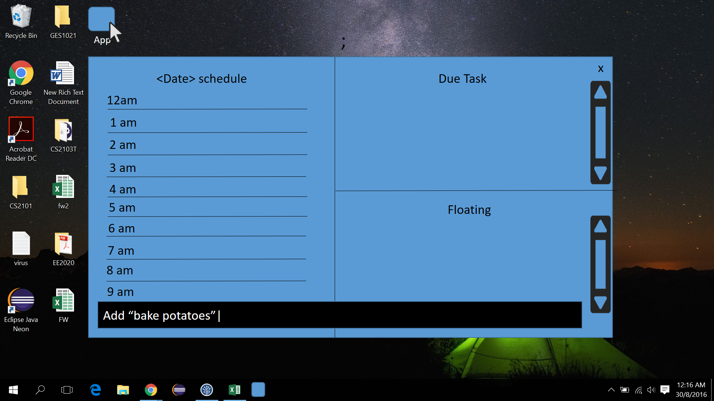
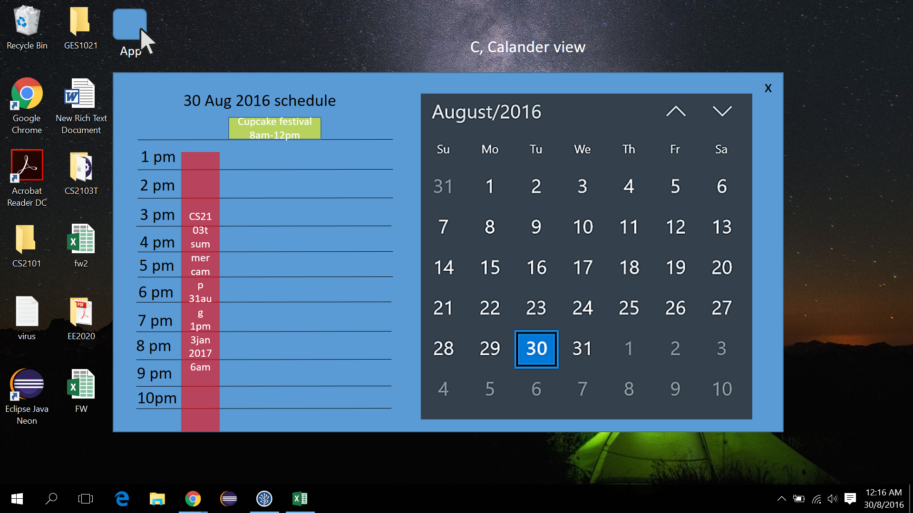

# User Guide

* [Quick Start](#quick-start)
* [Features](#features)
* [Command Summary](#command-summary)

## Quick Start

1. Ensure you have Java version `1.8.0_60` or later installed in your computer.

  > Having any Java 8 version is not enough.
  > This app will not work with earlier versions of Java 8.

2. Download the latest `TaskTracker.jar` from the 'releases' tab.

3. Copy the file to the folder you want to use as the home folder for your task
   database.

4. Double-click the file to start the app. The GUI should appear in a few
   seconds.

5. Set up: enter your name and verify the curent date and time.

6. You're good to go! Try adding your first Task. press ';' to launch/hide the
   command bar. Press Enter to enter a command. For floating task, `add
   [taskname]`!

   

7. Add task with due date/time, example commands are:

	* `add "bake cookies" 31/12 3pm` 
      bake cookies by 31 December of this year, 3pm.

	* `add "bake cookies" 3pm` 
      bake cookies by 3pm today.

   

8. Add event. An event is a task with a start time and end time, example
   commands are:

	* `add "CS2103t summer camp" 30/8 1pm 3/1/2017 6pm`

      Event CS2103t summer camp starts on 30 Aug 2016, 1pm, and ends on 3
      January 2017,6pm.

	* `add "potato peeling" 3pm 7pm`

      Event potato peeling starts today 3pm and ends today 7pm.

	* `add "cupcake festival" 30/08 8am 12pm`

      Event cupcake festival starts on 8am and ends on 12pm of 24 Oct of this
      year.

	* `add "Trick or treat" 8am 31/10 9am`

      Event Trick or treat starts today 8pm and ends on 31 Oct 9pm.

   The events for current selected day will show up under schedule.

   

9. To see the schedule of a different day, press 'C' to toggle calender mode on
   and off. Use arrow keys and enter to select the day to view. The schedule
   for the day will show up in the schedule column.

   

   

   Alternatively, use the command line to view schedules. For example: `view 30/08/2016`

10. To delete a task/event, try:

	    del "cupcake festival"

11. To edit a deadline, try:

	* `edit "bake potato" dd-12/10 dt-3pm`

      The following fields of task are modified: due date, due time. (`dd`
      refers to `due date`, `dt` refers to `due time`)

	* `edit "bake potato" dt-3pm`

      Due time of bake potato modified.

11. To edit an event, try:

	* `edit "cupcake festival" loc-NUS`

      Location of cupcake festival set to NUS.

	* `edit "cupcake festival" st-3pm sd-12/10 et-5pm -ed 13/10 loc-Yishun`

      All fields modified. (`st` : `starting time`, `sd` : `starting date`,
      `et` : `ending time`, `ed` : `ending date`)

    * `edit "cupcake festival" st-3pm`

      start time of cupcake festival modified.

12. To edit a floating task, try:

	* `edit "bake potato" p-1"`

      cupcake festival is given a priority of 1.

13. To exit the program, try:

	* `exit`

      Close the Task-tracker.

14. Refer to the [Features](#features) section below for details of each
    command.

## Features

**Command Format**

* Words in `UPPER_CASE` are the required parameters.

* Words in `lower_case` are the reserved keywords.

* Items in `[SQUARE_BRACKETS]` are optional parameters.

* Items in `<ANGLE_BRACKETS>` are partially optional parameters (a minimum
  number of partial optional parameters are required for certain command).

* Items seperated by `|` are in parallel relation, only one of them should be
  use in each command.

* Items with `...` after them can have multiple instances.

### Viewing help : `help`

    help

Help is also shown if you enter an incorrect command e.g. `abcd`

### Adding a floating task : `add`

Adds a floating task to TaskTracker.

    add "FLOATING_TASK_NAME" [PRIORITY]

* Task name should be in a pair of quotation marks.

* The floating task will be stored and shown to user according to the order of
  the time they created.

* The `PRIORITY` attribute is an integer which ranges from `0` to `5`.

* The default piority of the floating task is 0.

#### Examples

* `add EE2020 "lab report" 5`

* `add "ProgressReflection"`

### Adding a event-like task : `add`

Adds an event with specific starting and ending date or time to TaskTracker.

    add “EVENT_NAME” <STARTING_DATE> <STARTING_TIME> <ENDING_DATE> <ENDING_TIME> [loc/LOCATION]

* Event name should be in a pair of quotation marks.

* The four parameters `STARTING_DATE`, `STARTING_TIME`, `ENDING_DATE`,
  `ENDING_TIME` are not all required for adding event command.

  However, at least 2 of them are required from the command. Namely, at least
  one of `STARTING_DATE` and `STARTING_TIME` is required, and at least one of
  `ENDING_DATE` and `ENDING_TIME` is required.

* `STARTING_DATE` and `ENDING_DATE` must follow fixed formats : `dd/mm/yyyy` or
  `dd/mm` or `dd`, where `yyyy` is the numerical notation for years, `mm` is
  the numerical notation for months, and `dd` is the numerical notation for the
  date.

  The default year of `dd/mm` is the current year and the default month for
  `dd` is current month.

* `STARTING_DATE` and `STARTING_TIME` must follow fixed formats : `ABCD` which
  each letter represents a number ranges from 0 to 9. `AB` represent the hour
  in 24 hour system, while `CD` represent the minute. Letter `A` can be omitted
  if it is `0`.

* The default starting date will be the same as the real date on user's
  computer.

* The default ending date will be the same as the starting date.

* The default starting time will be `0000`.

* The default ending time will be `2359`

* `[LOCATION]` is a String which could contain any characters.

#### Examples

* `add "CS2103 week8 lecture" 7/10 1400 1600`

* `add "programming workshop" 1000 1700 loc-LT15`

* `add "sports training camp" 1/12/2016 10/12/2016`

* `add "job interview" 17/1/2017 900 1000 loc-Block 71`

### Adding a deadline-like task: `add`

Adds a deadline with specific due date or time to TaskTracker.

    add “DEADLINE_NAME” <DATE> <TIME>

* Dealine name should be in a pair of quotation marks.

* Either `<DATE>` or `<TIME>` or both of them are required here.

* Formats of `DATE` and `TIME` are the same as what we use to create event-like
  tasks.

* The default value of `DATE` will be the same as the real date on user's
  computer.

* There is no default value for `TIME` as long as the `DATE` passed in is
  valid.

#### Examples

* `add "CS2103 V0.1" 6/10`

* `add "event proposal" 1800`

* `add "EE2024 homework 1" 1/11/2016 600`

### Deleting a floating task/event/deadline: `del`

Delete a useless floating task/event/deadline on TaskTracker.

    del "TASK_NAME"

* Task name should be in a pair of quotation marks.

* Here we assume that no duplicate task name is used among all the task.

#### Examples

* `del "project meeting"`

* `del "CS2102 week 8 lecture"`

* `del "reading a book"`

### Edit a floating task: `edit`

Edit a floating task to revise its name or priority.

    edit "TASK_NAME" [n-NEW_NAME | p-PRIORITY]...

* Task name should be in a pair of quotation marks.

* `PRIORITY` should only be the interger ranges from `0` to `5`.

* Here we assume that no duplicate task name is used among all the task.

#### Examples

* `edit "washing clothes" p-0`

* `edit "buy textbooks" n-buy stationary`

* `edit "go shopping" n-"go to Nanyang Mart" p-1`

### Edit an event : `edit`

Edit an event to revise its name, starting/ending date/time and location.

    edit "TASK_NAME" [sd-NEW_START_TIME | st-NEW_START_DATE | ed-NEW_END_DATE | et-NEW_END_TIME | n-NEW_NAME | loc-NEW_LOCATION]...

* Task name should be in a pair of quotation marks.

* `[sd-NEW_START_TIME | st-NEW_START_DATE | ed-NEW_END_DATE | et-NEW_END_TIME]`
  are of the same format when creating event-like task.

#### Examples

* `edit "Excel Workshop" loc-LT6`

* `edit "3D printing training" st-1600 et-1800`

* `edit "project discussion" n-proposal meeting st-1900`

### Edit a dealine : `edit`

Edit a deadline to revise its name and due date/time.

    edit "TASK_NAME" [dd-DUE_DATE | dt-DUE_TIME | n-NEW_NAME]...

* Task name should be in a pair of quotation marks.

* `[dd-DUE_DATE | dt-DUE_TIME]` are of the same formate when creating
  event-like task.

#### Examples

* `edit "essay assignment 1" dt-1700`

* `edit "write email to prof." dd-23/11/2016`

### Mark a floating task/deadline as done/finished: `fin`

Mark a floating task/event/deadline as done on TaskTracker, the marked tasks
will be archived.

    fin "TASK_NAME"

* Task name should be in a pair of quotation marks.

* Deadlines that have already passed it `DUE_TIME` will be marked as done
  automatically.

#### Examples

* `fin "project meeting"`

* `fin "watch a movie"`

### Show empty time slots : `slot`

Show all empty time slots in a given time period with a given duration.

    slot <STARTING_DATE> <STARTING_TIME> <ENDING_DATE> <ENDING_TIME> <h-HOUR> <m-MINUTE>

* At least one of `<STARTING_DATE> <STARTING_TIME>` are required.

* At least one of `<ENDING_DATE> <ENDING_TIME>` are required.

* At least one of `<h-HOUR> <m-MINUTE>` are required.

#### Examples

* `slot 1/11/2016 3/11/2016 h-4`

* `slot 5/11/2016 1400 2300 m-45`

### View a date: `view`

View all the task of a specific date in the Calander View of TaskTracker.

[=

### Clearing all entries : `clear`

Clears all entries from TaskTracker.

    clear

### Exiting the program : `exit`

Exits the program.

    exit

## Command Summary

Command | Format
------------ | :--------
Add Floating Task | `add "FLOATING_TASK_NAME" [PRIORITY]`
Add Event |`add “EVENT_NAME” <STARTING_DATE> <STARTING_TIME> <ENDING_DATE> <ENDING_TIME> [loc/LOCATION]`
Add Deadline |`add “DEADLINE_NAME” <DATE> <TIME>`
Delte a task | `del "TASK_NAME"`
Edit Floating Tasks | `edit "TASK_NAME" [n-NEW_NAME | p-PRIORITY]... `
Edit Event |`edit "TASK_NAME" [sd-NEW_START_TIME | st-NEW_START_DATE | ed-NEW_END_DATE | et-NEW_END_TIME | n-NEW_NAME | loc-NEW_LOCATION]... `
Edit Deadline |`edit "TASK_NAME" [dd-DUE_DATE | dt-DUE_TIME | n-NEW_NAME]... `
Generate recomanded time slots | `slot <STARTING_DATE> <STARTING_TIME> <ENDING_DATE> <ENDING_TIME> <h-HOUR> <m-MINUTE>`
Mark a task as finished | `fin "TASK_NAME"`
View a date in calander| `view DATE`
Search for keywords | `srch KEY_WORDS`
Help | `help`
Unod | `undo`
Clear | `clear`
Exit | `exit`
