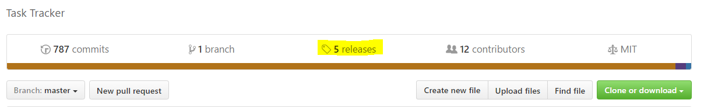
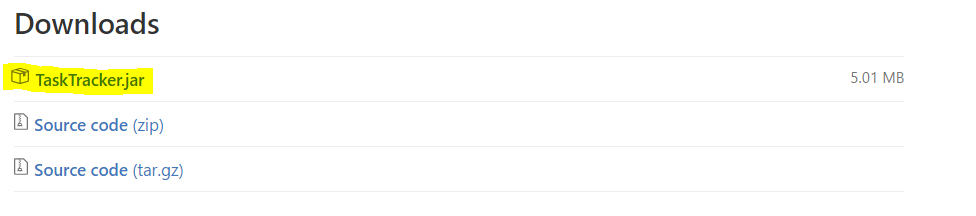
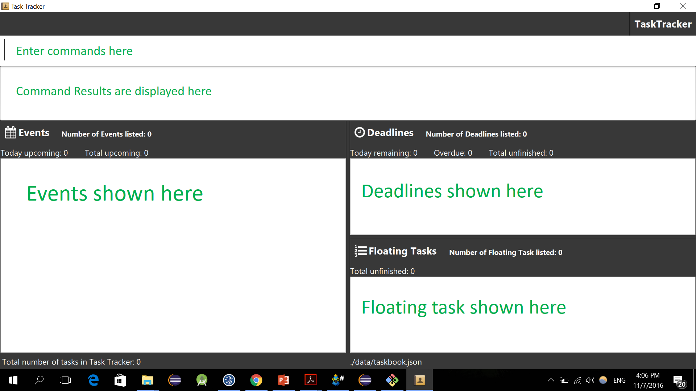
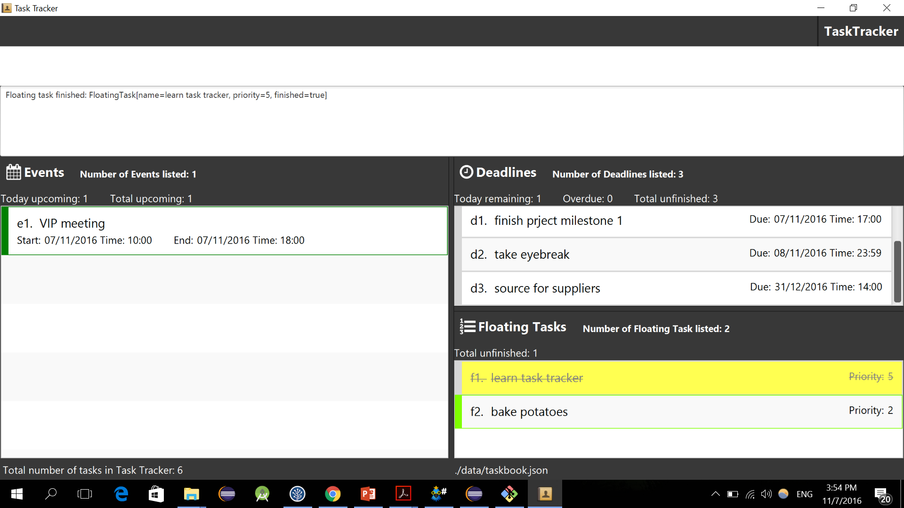
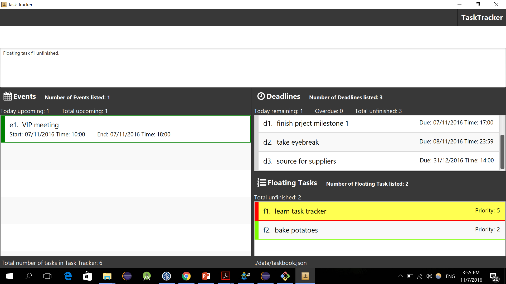
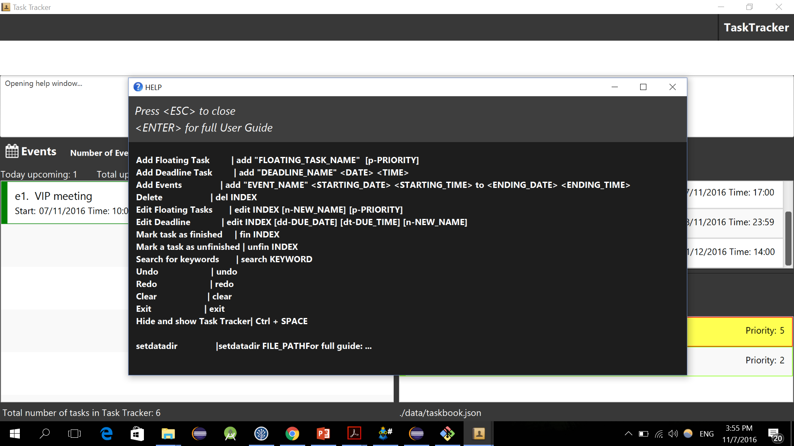
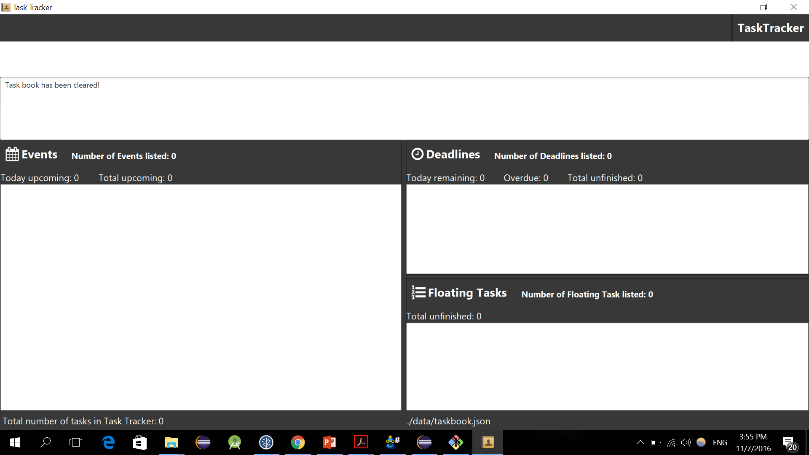
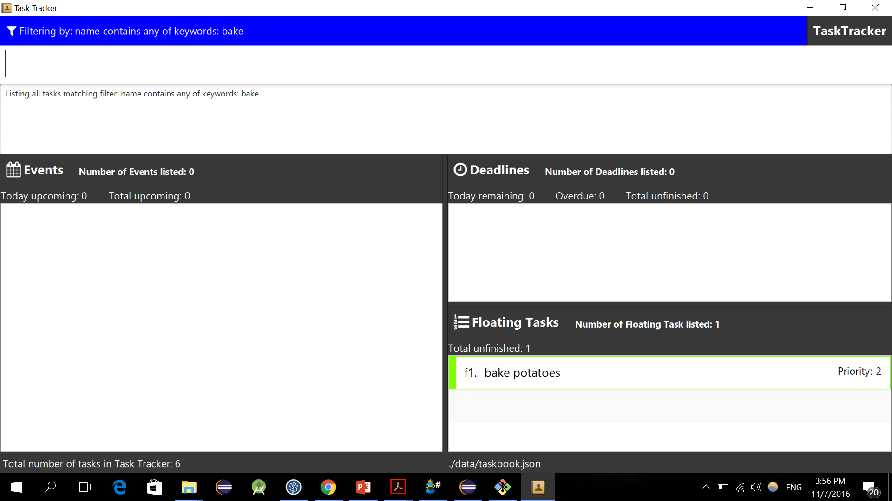

# User Guide

## About

Unable to keep track of all your deadlines and other commitments?  Finding it
difficult to remember tasks which do not have a specific date and time, but
nevertheless needs to be done?

Fret not, TaskTracker is here to your rescue!

To be simply defined, TaskTracker is a digital assistant that keeps your
schedule neat and organized. It displays all your events lined up for the day,
upcoming deadlines and also tasks that do not have a specific time/ date, on
the same window.

You can perform various operations such as add/ delete/ edit/ prioritize, on
your events by simply typing a one-line command,
as TaskTracker has a flexible command line interface suited to your needs and comfort.
You don’t need to waste any
more time navigating through multiple options or filling multiple fields every
time you want to modify your schedule.

TaskTracker makes time-management smart and simple for you!

## Quick Start

###Installing

1. Ensure you have Java version `1.8.0_60` or later installed in your computer.

    > Note: Having any Java 8 version is not enough.
    > This app will not work with earlier versions of Java 8.

2. Download the latest `TaskTracker.jar` from the 'releases' tab of https://github.com/CS2103AUG2016-T11-C4/main





3. Copy the file to the folder you want to use as the home folder for your task database.

### Launch
Double-click the file to start the app. The GUI should appear in a few seconds.



### Using the Interface
You're good to go! Type your command in the command box and press `ENTER` to launch it.

Get a feel of the interface by trying these sample commands:
  * `add "get started"` : adds a new floating task get started
  * `fin f1` : marks the floating task with index f1 as finished
  * `del f1` : delete floating task with index f1
  * Ctrl + SPACE to hide Task Tracker
  * Ctrl + SPACE again to bring Task Tracker back to the foreground
  * `exit` : exits the application

## Some points to note

All tasks stored in TaskTracker will be automatically categorized into three different types: floating task, deadline task, and event, depending on the types and number of parameters entered when created.

|A/An... | has...|
|----| :-------------------------------------|
|Floating Task | only a task name|
|Deadline task |  end time and date |
|Event | start time and date,  end time and date|

###Special Time Representation

|Keyword | Definition     |
|----| :------------------|
|`tdy` | today|
|`tmr` | tommorow|
|`yst` | yesteday|

### Date Format

Valid input examples:

* dd/mm/yy

    ```
    31/12/2016
    ```

* dd/mm

    ```
    3/12
    ```

    If the year is not given, the default year will be the current year as logged by the local machine.

* dd

    ```
    31
    ```

    If the month is not defined, the default month will be the current as logged by the local machine.

* Today

    ```
    tdy
    ```

    Means today, the current date as logged by the local machine.

* Tommorow

    ```
    tmr
    ```

    Means tommorow, the day after date as logged by the local machine.


### Time Format

The 12-hour clock is used. `hh:mm` + `am/pm`

Valid input examples:

* `8:30am`

    8:30am in the morning

* `11:45pm`

    11:45pm at night

* `8pm` or `8:00pm`

    8:00pm at night

If the minute field is `00`, it may be ommitted from the command.

## Basic Features

### Add a Floating Task
Try adding your first Task. Press Enter to enter a command. For adding a floating task, try:
   
   add "Learn Task Tracker"


    
You're at work and you crave baked potatoes. Let's do another one:

	
    add "bake potatoes" p-2
    


* Most recently added Task will be highlighted yellow. 

* Tell Task Tracker the priority of your Task, by typing p-PRIORITY, where PRIORITY is a number from 0 to 5.

* Notice how `bake potatoes` is above `Learn Task Tracker`. That's because
`bake potatoes` is of number 2 priority, while `Learn Task Tracker` with an
undefined priority takes the default lowest priority number of 0.

* If you create two floating tasks with the same PRIORITY, they will be shown in order of the time they were created.
    
* Task Tracker supports your love for all things short and sweet. For one worded task names, quotation marks need not be used.

### Add a Deadline Task
You receive an email from your boss, requesting for the project proposal to be in by 31 dec of this year, 3pm. Let's add a deadline tasks with due date and time.
  	
    add "submit project proposal" 31/12 3pm

* Undeclared year in date field will be taken as the current year.
         
You decide to set a deadline for the first milestone of your project to be completed by today, 5pm.

 	add "finish project milestone 1" 5pm
    
 While working so hard and staring at the computer screen continuously, your eyes start to feel tried. The eyebreak you took just now was really good. You should take an eye break tommorrow too.
 	
    add "take eye break" tmr


* Keywords like `tdy`, `tmr`, `yst`, can be used in the `DATE` field.

* Formats of `DATE` and `TIME` should follow those stated above in this user guide. See [Date Format](#DateFormat) and [Time Format](#TimeFormat)

* Task Tracker understands the importance of tackling the tasks which are due soon, first. Therefore, deadline task are automatically arranged according to their due dates and times. Those with encroaching deadlines are placed at the top of the list. 
 
* Typing additional words when you don't actually need to can be a chore. Task Tracker cuts your fingers some slack by taking an undeclared date as today, and an undeclared time as the end of the date specified. However, at least either one date or time has to be specified for deadline task, or task tracker will mistake it for a floating task!
 
* In the unfortunate event of an overdued deadline task, Task Tracker will highlight the deadline task with a glaring red.

### Add an Event Task

Your phone bleeps. Wow, an invitation to attend the Avengers meetup organised by Dr Strange! It happens tommorow, 10pm to 11 pm.
   
    add "avangers meetup" tmr 10pm to 11pm
  
* Next up, events. An event is a task with a start date, start time, end date
and end time. The word `to` is used to seperate the start date and time from the end date and time. It is also how you tell Task Tracker that the task is an event. When you don't inform Task Tracker of the end date, Task Tracker will assume that the event ends on the same day which it starts.

You recieved an urgent call from boss! There is a VIP meeting today, 4pm to 6pm.
   
    add "VIP meeting" 4pm to 6pm


* As with deadlines, Task tracker will take an unspecified start date to be today.

* Task Tracker will keep track of Events that has already passed, strike them out for you, and highlight ongoing events green. 

* Events are automatically arranged in order of start date and time, so that you know which event to zipp to next with a quick glance at the top of the events pane.  

### Delete a Task

Given the amount of work you have to do, you decide not to go to the Avengers meetup. Let's delete that from Task Tracker.

    
    del e1
    


* Can you guess the pattern? Same thing applies for deleting Deadline and Floating Task! It is always `del` followed by the index of the Task, which can be seen situated to the left of the Task. Index for Events, Floating task and Deadline tasks have prefix `e`, `f`, and `d` respectively. 
	* `del INDEX`

* You can delete finished Tasks too.

### Edit a Floating Task
Since you're almost done learning Task Tracker, why not aim to finish it soon. Let's increase it's priorty to 5.  

	edit f1 p-5


* The format is Field_reference-New_Field. In this example p- is the field refernece and 5 is the new field. 

|Field reference | Definition                    |
|:----------------|:-----------------------------|
| n- | name |
| p- | priority |

As with editing any type of Task, you may add on, in any order after `edit INDEX`, multiple fields which you want to edit. Seperate the fields with a SPACE. Prefix your changes with the Field refernce provided in the table above for the respective fields you want to edit.

* `edit INDEX n-NEW_NAME p-NEW_PRIORITY` 

* Quotation marks are not required for `NEW_NAME`.

* `PRIORITY` is an integer ranges that from `0` to `5`.


### Edit a Deadline Task
You decide to give your project milestone a specific name. Also, with Task Tracker to improve your efficiency, you estimate that you can finish your first milestone faster and hence you shift forward your deadline.

	edit d1 n-source for supliers dt-2pm


* The following properties of Deadline Task are modified: name and due time. 

|Field reference | Definition                        |
|:----------------|:---------------------------------|
| n- | name |
| dd- | due date |
| dt- | due time |

As with editing any type of Task, add on, in any order after `edit INDEX`, the fields which you want to edit. Seperate the fields with a SPACE. Prefix your changes with the Field refernce provided in the table above for the respective fields you want to edit.

* `edit INDEX n-NEW_NAME dd-NEW_DUE_DATE dt-NEW_DUE_TIME` 

* Quotation marks are not required for `NEW_NAME`.

### Edit an Event Task
You recieve an email saying that the VIP meeting's start time has been brought forward to 10am. You take note of that by editing the start time of VIP meeting in Task Tracker

	edit e2 st-10am


|Field reference | Definition                  |
|----------------|:--------------------------- |
| n- | name |
| sd- | start date |
| st- | start time |
| ed- | end date |
| et- | end time |

As with editing any type of Task, add on, in any order after `edit INDEX`, the fields which you want to edit. Seperate the fields with a SPACE. Prefix your changes with the Field refernce provided in the table above for the respective fields you want to edit.

* `edit INDEX n-NEW_NAME sd-NEW_START_DATE st-NEW_START_TIME ed-NEW_END_DATE et-NEW_END_TIME` 

* Quotation marks are not required for `NEW_NAME`.

### List all Tasks
After all the adding, editing and deleting, you may notice that the indexes are out of order. If that irks you, simply enter `list` into the command bar. Your indexes should be reordered.

	list
    


### Mark a Task as Finished
You've finished learning Task Tracker. Let's mark it as finished.

     fin f1


* Mark task as finished with this format: `fin INDEX`

### Mark a Task as Unfinished

Hang on, you're not done! There's still more to learn about Task Tracker! Mark learn Task Tracker as unfinished.

	unfin f1
    

* Mark task as unfinished with this format: `unfin INDEX`

### Help

Help goes to those who call for it! 

	help
    

A pop up help box with the command summary will appear below the command bar for your reference while you type in commands into the command bar.

With the help box in focus, 
* press ENTER to launch the full userguide (this guide basically)
* press ESCAPE to close the help box
* Help is also shown in the result box if you enter an incorrect command e.g. `abcd`

## Special Features

### Clear all tasks

Sometimes Task Tracker gets cluttered with finished tasks and tasks you no longer need. Use clear to wipe clean all Task from Task Tracker.

	clear
    


### Undo

We, as humans, tend to make mistakes. You may have cleared Task Tracker but remember later that you still have unfinished tasks! Thankfully, Task Tracker has that covered. With one single word `undo`, the operation gets reversed and all of the deleted tasks appear back on screen.

	undo
   
### Redo

Task Tracker also provides the "redo" command in case you realise that you did not need to undo that command after all.

	redo
    
Together, the "undo" and "redo" commands provide a comprehensive safety net for you, so that you can execute your commands at top speed without any worries, knowing that your data is safe as you can always revert back if something goes wrong.

> Note: The list of actions queued for undo and redo gets erased upon exiting Task Tracker.

### Quick Pop Up
Task Tracker is able to run in the background (press Ctrl+Space), hidden from view, and with a simple Ctrl-Space, Task tracker pops up, ready to accept your commands. No matter what time it is, or which application you are using, Task Tracker is always just a keyboard shortcut away.

	Ctrl + SPACE

> Note: Works on Windows only.

### Find by keywords

Task Tracker getting too cluttered? Need to find Task containing a specific keyword? Use the find command!

	find KEYWORD



To show all tasks again, use the `list` command.

### Auto Complete

Task Tracker has an extremely useful tab-completion feature.  Let's say you love to unicycle in your spare time, and on the 31st of december, you decide to have some unicycling practice by riding a unicycle, juggling 3 balls while balancing a bat on your nose. You enter a very long event name into Task Tracker: "unicycling practice, juggle 3 balls while balancing a bat on my nose". Now, one day, you look at this event and thinks that, hmm, maybe I should increase the difficulty and juggle 10 balls instead. Well, if you used one of the conventional command-line task management applications, you would have to type out the entire name of the event just to change one single number. Extremely annoying, and a huge productivity drainer. This is where our tab-completion feature comes in to save the day. 

	edit INDEX n-<TAB>

Tab-completion can also help you to auto-complete things like the command names. Let’s say you forgot the name of a command. Well, just press tab on the command box, immediately a list of all available commands will appear, letting you select them(tab through the autocomplete list).

### Set data storage directory
To change the file path which holds Task Tracker's storage data, type

	setdatadir FILE_PATH
	
Where `FILE_PATH` is the file path to the directory, eg. `C:\Users\Potato\Desktop`

Congratulations! You have officially finished learning task tracker. Take on this challenge: Mark learn task tracker as finished.

	fin learn task tracker

## Command Summary

* Words in `UPPER_CASE` are parameters to be defined by the user.

* Words in `lower_case` are the reserved keywords. All keywords can not be changed in each command line.

* Items in `[SQUARE_BRACKETS]` are optional parameters. All paramters in square backets can be omitted.

* Items in `<ANGLE_BRACKETS>` are optional parameters. However, a certain number of these kind of parameters will be required in different commands.

* The parameters except for those in `[SQUARE_BRACKETS]` have to follow the order in which they are presented.

Command | Format
------------ | :---------------------------------------------------------------
Add Floating Task | `add FLOATING_TASK_NAME  [p-PRIORITY]`
Add Deadline Task | `add DEADLINE_NAME <DATE> <TIME>`
Add Events | `add EVENT_NAME <STARTING_DATE> <STARTING_TIME> to <ENDING_DATE> <ENDING_TIME>`
Delete | `del INDEX`
Edit Floating Tasks | `edit INDEX [n-NEW_NAME] [p-PRIORITY]`
Edit Deadline | `edit INDEX [dd-DUE_DATE] [dt-DUE_TIME] [n-NEW_NAME]`
Edit Events | `edit INDEX [n-NEW_NAME] [st-START_TIME] [sd-START_DATE] [et-END_TIME] [ed-END_DATE]` 
Mark task as finished | `fin INDEX`
Mark a task as unfinished | `unfin INDEX`
Clear | `clear`
Undo | `undo`
Redo | `redo`
Find keyword | `find KEYWORD`
Hide and show Task Tracker | Ctrl + SPACE
Auto Complete | TAB
setdatadir |`setdatadir FILE_PATH`
Exit | `exit`
