# Product survey on Todoist

## Introduction

Todoist is a powerful, cross-platform productivity tool. It's available on the
web, for iOS and Android with desktop apps for Windows and OSX, add-ons for
Firefox and Chrome, plug-ins for email apps like Postbox, Gmail, Thunderbird,
and Outlook, and more.

It also packs sub-tasks and dependencies, real-time syncing, projects and
sub-projects so you can manage daily checklists or big plans that involve lots
of people, understandable due dates, multiple priorities, categories and
projects you can set, and more. A premium account is required if you want
notifications or reminders via email or push notifications on your mobile
device. You also get labels and filters to further organize your to-dos.

## Keyboard-oriented (for PC and Web client only)

Todoist is not a fully keyboard-oriented application. Actions will not be done
by passing in commands lines and most of interactions and manipulations can be
done using mouse through the pre-designed user interface. However, in Todoist
there are Keyboard shortcuts provided to users.

#### Positive:

Shortcuts in Todoist help users save time by allowing them to never take their
hands off the keyboard to use the mouse.

#### Negative:

Todoist does not support command line inputs.

### Shortcuts that can be used anywhere:

Shortcut | Action
:---------------- | ----------------
<strong> Ctrl + Click </strong> or <strong> Shift + Click </strong> on task | Select and update multiple tasks at once
<strong>q</strong> | Quickly add task from anywhere
<strong>a</strong> | Add a new item to the bottom
<strong>A</strong> | Add a new item to the top
<strong>/</strong> | Moves the focus to the query box
<strong>s</strong> | Sort items by date (project view only)
<strong>p</strong> | Sort items by priority (project view only)
<strong>r</strong> | Sort items by responsible (project view only)
<strong>u</strong> | Undo last action (when possible)

### Shortcuts when editing or inserting items：

Shortcut | Action
:---------------- | ----------------
<strong>Esc</strong> | Cancel current edit
<strong>Enter</strong> | Save current item and append a new item below it
<strong>Ctrl + Enter</strong> | Save current item and append a new item above it
<strong>Shift + Enter</strong> | Save currently edited item and append a new item below it
<strong>Ctrl + LeftArrow</strong> | Indent the item one time to the left. You can use this to create sub-items (works only inside projects)
<strong>Ctrl + RightArrow</strong> | Indent the item one time to the right. You can use this to create sub-items (works only inside projects)
<strong>Ctrl + UpArrow</strong> | Save current item and edit item above it
<strong>Ctrl + DownArrow</strong> | Save current item and edit item below it
<strong>Shift+Click</strong> | Complete and move to history a sub-task or a recurring task (you need to hold Shift while checking it off).
<strong>Ctrl + M</strong> | Add a new Quick Comment
<strong>@</strong> | Define the label for the task
<strong>#</strong> | Define the project for the task
<strong>+</strong> | Define the assignee for the task
<strong>p1, p2, p3</strong> | Define the priority of the task

## Works offline

#### Positive:

Todoist can work both online and offline.

Offline service will only be provided to the users who have downloaded
client-side application on either PC or mobile phone. When the local
client-side application is connected to the Internet, syncing with the web
client will also be available.

## Cannot be summoned quickly

#### Negative:

Todoist cannot be summoned by shortcuts on the keyboard.

## CRUD for Tasks

#### Positive:

Todoist has full support for the create-read-update-delete(CRUD) of floating
tasks and deadline-like tasks.

#### Negative:

Todoist does not support CRUD for event-like tasks.

### Quick Add Floating Tasks

Click the quick-add button at the top of the application.

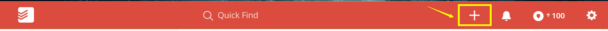

Type in the title and then choose "No due date" to create floating task. And
then click "Add Task" to finish.

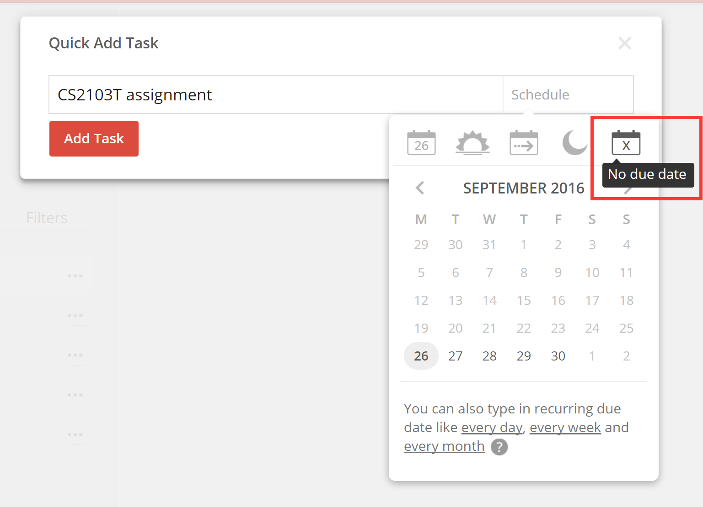

### Quick Add deadline

In quick adding windows, choose a date for a deadline-like task. The user can
either choose the date by themselves or use the relative time button to set the
due time.

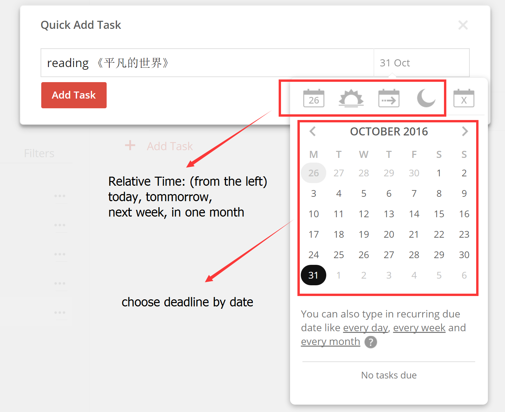

### Adding a task that belongs to a #project (Method 1)

In quick adding windows, click "Project" and then click the project you are
going to add. Projects can be customised by users.

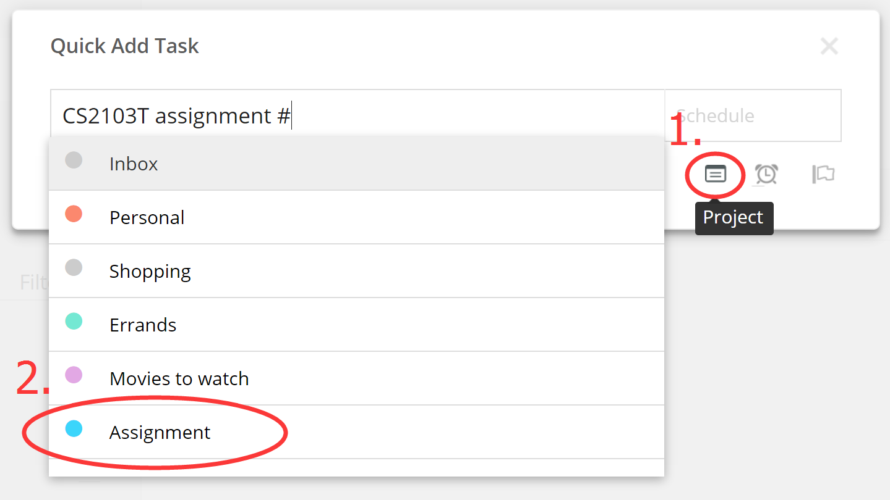

Then click "Add Task" button.

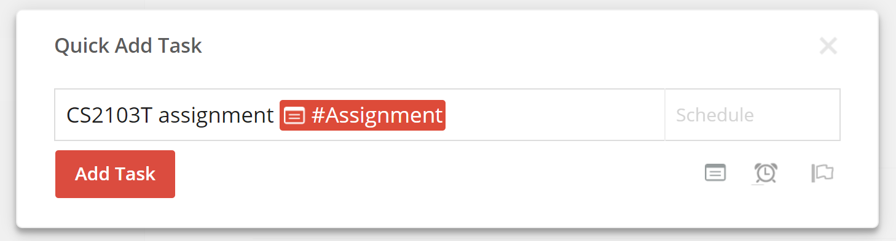

### Adding a task that belongs to a #project (Method 2)

Click on certain projects and then click "Add Task" to this project.

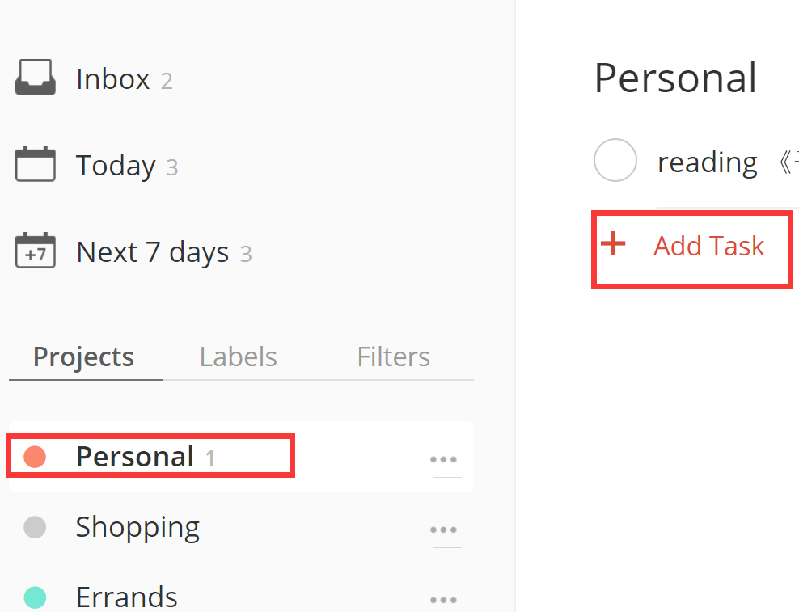

And then the process is similar to "Quick Adding".

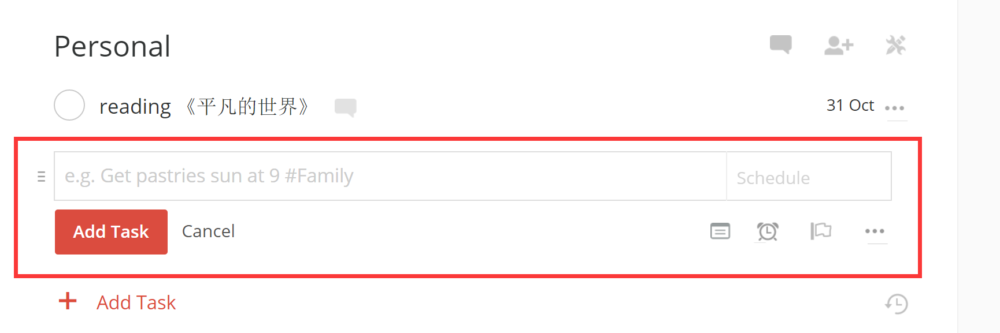

### Adding a task with priority

In quick adding windows, click "Priority" and then give your task a priority.
Then click Add Task when it is finished.

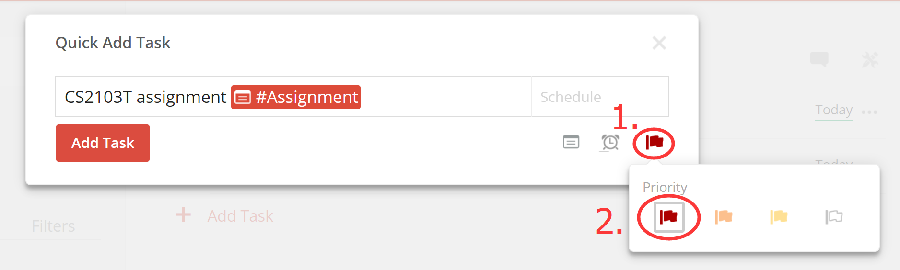

### Read Tasks Through Filter

1. Click "Filter" and then select "No due date" to view all floating task.

2. Click "Filter" and then select "Priority 1" to view all tasks that have the
   highest priority. (Same for "Priority 2", "Priority 3", "Priority 4")

3. User can add their own filter to add more filter views. (premium account)

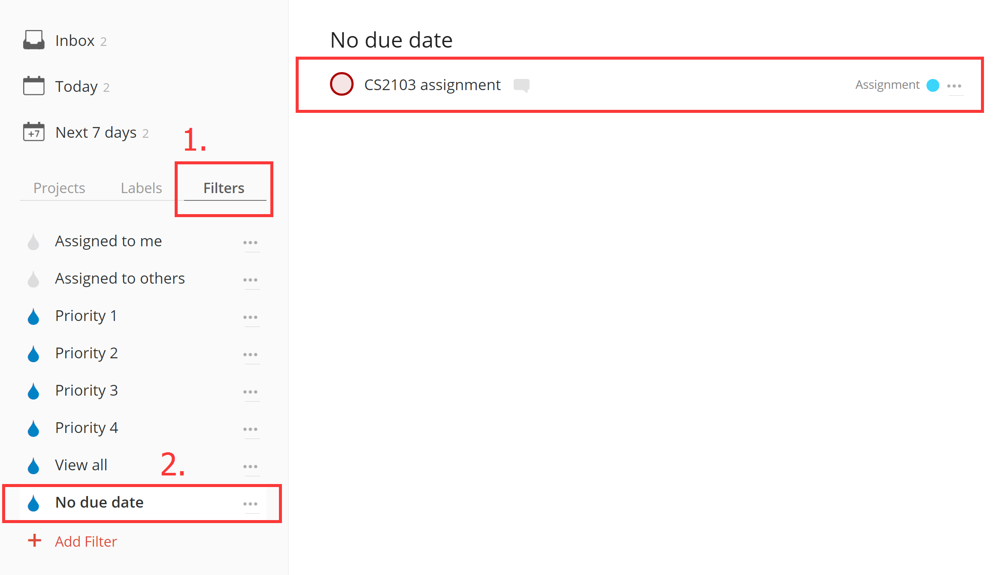

### Simple Search

1. User can type in "no date" or "no due date" on the search bar to see all
   floating tasks.

2. User can type in certain date to see all the tasks on that day.`

3. User can type in some keywords to see all the tasks containing the certain
   keywords.

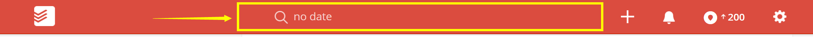

### Updating Tasks

Click on the task that is going to be updated.

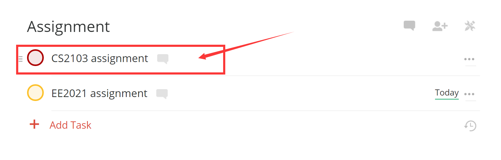

The user can change every attributes that he previously gives to it and the
user can also change the floating task to a deadline-like task or vice versa.

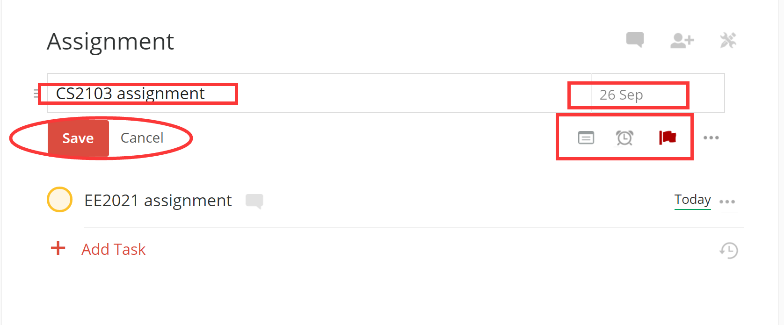

### Deleting Tasks

Click on the "..." symbol next to the task and then click delete task.

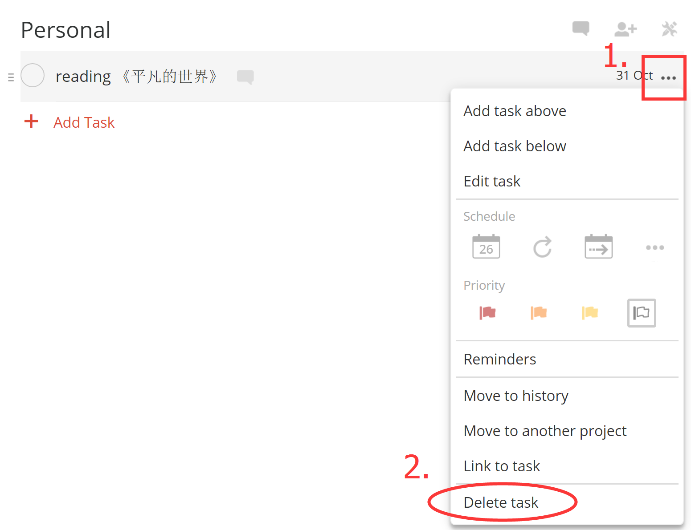

## Looking for a suitable time to schedule a task

### For deadline-like task:

#### Positive:

When the user wants to add task on specific date, Todoist can tell how many
tasks are already there on that date.

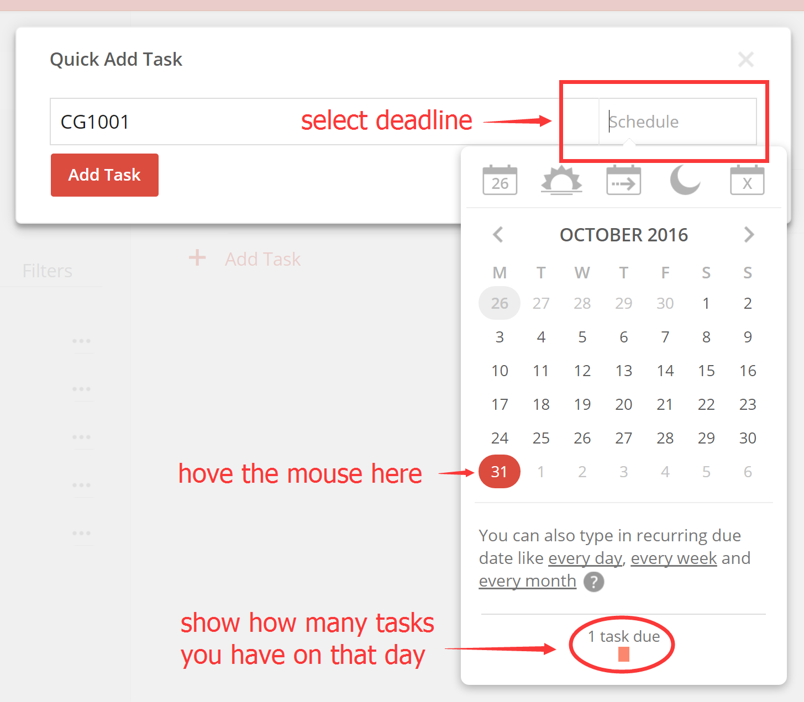

### For event-like task:

#### Negative:

Todoist does not support adding events.

## Ability to “block” multiple slots.

#### Negative:
Todoist does not support this function.

## Flexibility in command line format

#### Negative:

Todoist does not support command line inputs.

## Undo operations

#### Positive:

Todoist can undo the last one action that the user performs.

## Summary
Jim’s Requirement | Todoist support
:---------------- | ------------------
Summoned quickly from anywhere | No
Keyboard-oriented. Jim can type commands in “one shot”. | No
Keyboard-oriented. Jim can use keyboard shortcut to increase efficiency. | Yes
Works offline | Yes
Simple Search | Yes
CRUD support for floating tasks | Full
CRUD support for deadlines | Full
CRUD support for events | None
Keep track of which items are done/not done | Yes
Look for a suitable time schedule a task. | Tiny
Ability to “block” multiple slots. | No
Flexibility in command line format. | No
Undo operations | Partial

Todoist is a half keyboard oriented cross-platform applications, with plenty of
useful keyboard short-cut on both PC and Web clients. It can work both online
or offline on mobile phone or personal computer.

It fully supports creation, reading, updating and deleting (CRUD) function of
floating tasks and deadline-like task. The user interface is well designed and
user can perform their actions quite easily through it. Besides, user can also
conduct simple searching action among all task he or she has created. However,
Todoist also does not support the functionality to add event-like task at all.

Also for premium account, Todoist also gives the support of tracking the task
that has already been done or finished, which gives convenience for user to
record their working history.

Besides, Todoist can automatically suggest how many tasks have already existed
on a certain day when creating the tasks. But since Todoist does not support
event-like task, it also has no support at all for generating suggestion of
suitable time-slots or placing multiple time slots/blocks when creating the
tasks.

Moreover, Todoist does support undo-actions, but only for the last one actions
the user performs.

Furthermore, there are several features that we could learn from Todoist. The
first one is the “Quick-Add” function which enables the user to add either
floating task or deadline task in a single window. The second one is the “Undo”
command, which enables the user to undo the last command immediately when them
perform wrongly.
