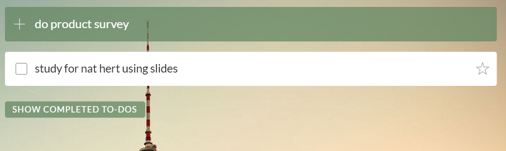
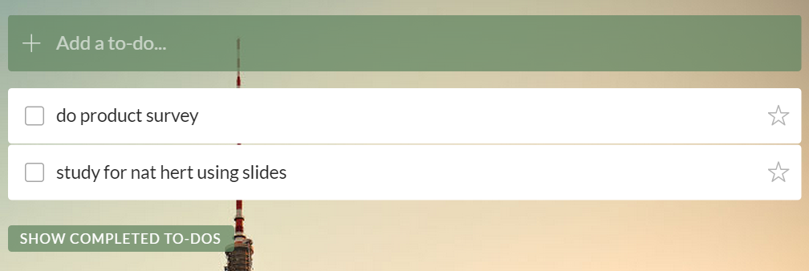
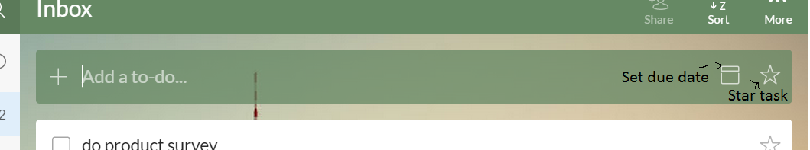
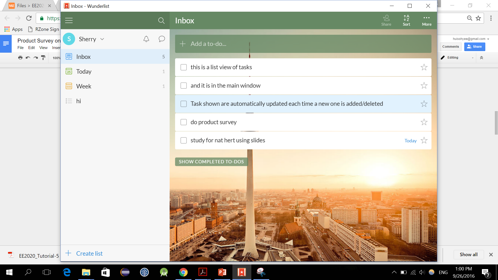

# Product survey on Wunderlist.exe

## Introduction

Written in Javascript and PHP, Wunderlist is a task manager application with a
simple, intuitive,and beautiful User Interface that is installed locally on the
hard disk. It has server functions to share todo lists and is able to sync
information using a Wunderlist account. Thus CRUD of local tasks work offline,
but with online, additional syncing, sharing and collaborating features are
accessible.

Throughout this survey, task and to-do mean the same thing.

## CRUD for Tasks

Wunderlist supports the full functionality of Create Read Update Delete of
tasks.

**Creating Tasks**

With the cursor at the To-Do bar, a task can be added by simply typing in the
name and hitting enter. Multiple task can be created with ease with only the
keyboard by repeating the above step. A new task can be created with the
default short-cut keys: Ctrl+N. This brings the cursor to the to do bar without
having to use the mouse.

Setting a due date and starring (highlighting) the task can be done during the
creation of a task. This requires point and click to click on the Set Due Date
and Star task icons.

**Reading Task**

A list view of task is always shown in the main window of Wunderlist. It is
automatically updated to reflect any changes made to tasks.

Different lists can be created to group task. To create a list, click on +
Create list at the bottom left of the window, or use the default shortcut keys:
Ctrl+Shift+L. The column on the left houses the different lists. User can use
point and click or arrow keys to toggle between the different list. Inbox is
the name of the default list.

**Updating Task**

Wunderlist allows user to add/change the following details of a task after its
creation:

* Task name

* Due date

* Reminder date

* Subtask

* Task notes

* File attachments

To do so, user must select the task, and the editable Task details column will
appear. This can be done by point and click. Task selection can also be done
with the arrow keys, but first the user have to toggle the cursor to a Task.
(For example if the cursor is at the To-do bar, pressing the arrow keys will
not work. User will first have to click on a task). The selected Task is
highlighted Cyan, while the rest will appear white.

**Deleting Task**

For deleting a task, i.e removing a task from the list view, there are two ways
it can be done.

1. 1)Mark as completed, task will then be transferred to completed task list
2. 2)Permanently delete from memory

1) To mark a task as complete, click on the small square box on the task, or
use short cut keys: Ctrl+D (Task must be highlighted cyan first). A
&quot;Ding&quot; will sound  on successful mark completion of a task.

2) To permanently delete from memory, right click on task, and click on Delete
To-Do. Or, when the task is selected, use short-cut keys: Ctrl+Backspace

## Features:

## CRUD of tasks works offline

**Positive:**  Performs the basic functions of task management without
dependency on a constant  internet connection.

## Sync from account

Automatic syncing when there is internet connection. Option to manually sync by
clicking &lt;My profile name&gt; → Sync Now or by pressing R.

Positive: a user&#39;s wunderlist data can be used across machines. For
example, user bought a new laptop. After downloading Wunderlist on new machine,
user can import his/her data from previous wunderlist into new wunderlist,
since data is saved to an account stored on the server.

## Sharing Lists

All list except the default inbox list can be shared. Add list collaborators by
typing their wunderlist account name/registered email. Works only with internet
connection.

Positive: A team&#39;s todo list, viewed and updated in real time. Allows team
members to know what has been done, left to do, details of the task.

Assign to whom option in shared list. Option to view tasks &quot;Assigned to
me&quot;

Positive: easy assignment of roles and tasks in a team. Clear view of
user&#39;s responsibilities.

## Short cut keys

Table of functions assigned with shortcut keys

| Add new to do | CTRL+N |
| --- | --- |
| Add new List | CTRL+SHIFT+L |
| Mark selected todos as completed | CTRL+D |
| Star selected todos | CTRL+S |
| Select all to-dos | CTRL+A |
| Delete selected list or to-do | CTRL+BACKSPACE |
| Copy selected todo | CTRL+C |
| Paste todo | CTRL+V |
| search | CTRL+F |
| sync | R |

Shortcut keys are fully customisable.

Positive: Increases user flexibility. Suitable for users who prefer to use the
keyboard.

Negative: It is still not completely functional via keyboard only. Eg. point
and click must be used to switch out of create task mode to carry out other
functionalities.

## Today&#39;s list and This Week&#39;s list

Task with due dates are automatically sorted into Todays list and This
week&#39;s list.

Positive: useful for keeping track of deadlines due today and due in a week.

## Arrange tasks in list

Drag and drop task in a list to arrange them.

Positive: A way of prioritising task

Negative: Only achievable via point and click.

## Summon Wunderlist via point and click on app icon

Negative: Slow

## View completed task

Positive: keep track of what has been done, especially useful in a shared list
where the marking a task as complete may be done by others

Negative: have to do a constant cleanup of todos in the completed todos list.
There is the option of selecting all using

## Undo an action

No command or key to do that, but there is a function to unmark a completed
todo. This restores the task from the completed task list back to the list it
was from.

## Simple search

Ctrl+F to search

## Summary

So, how well does Wunderlist satisfy Jim's requirements?

| Jim's Requirement | Wunderlist support |
| --- | --- |
| Summoned quickly from anywhere | No |
| Keyboard-oriented. Jim can type commands in "one shot". | Partially |
| Works offline | Yes |
| Simple Search | Yes |
| CRUD support for floating tasks | Full |
| CRUD support for deadlines | Full |
| CRUD support for events | None |
| Keep track of which items are done/not done | Yes |
| Look for a suitable slot to schedule an item. | No |
| Ability to "block" multiple slots. | No |
| Flexibility in command line format. | No |
| Undo operations | Tiny |
